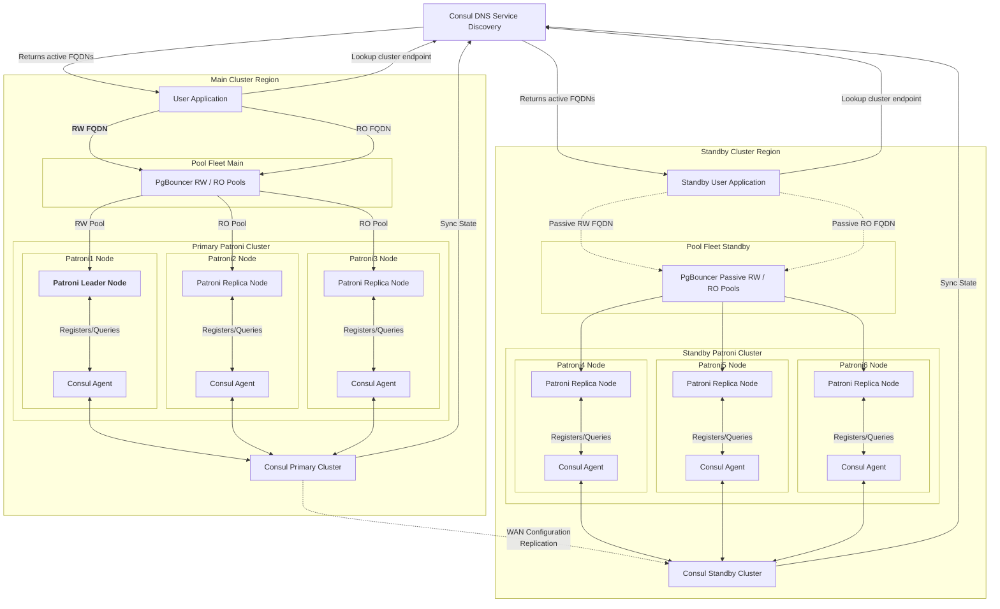
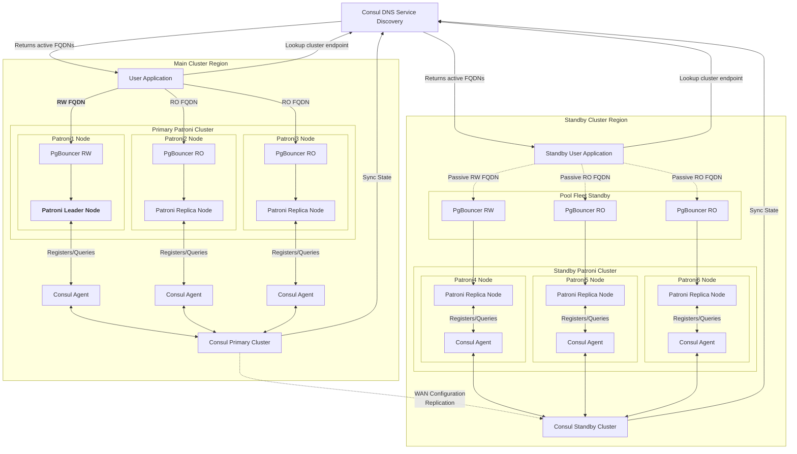

# Multiregion with Patroni and Consul

## Patroni and Consul with DNS Service Discovery

```mermaid
graph TD


DNS[Consul DNS Service Discovery]
DNS -- Returns active FQDNs --> UserApp
DNS -- Returns active FQDNs --> StandbyUserApp
UserApp -- Lookup cluster endpoint --> DNS
StandbyUserApp -- Lookup cluster endpoint --> DNS

ConsulPrimary -- Sync State --> DNS
ConsulStandby -- Sync State --> DNS

subgraph Main Cluster Region
    UserApp[User Application]

    ConsulPrimary[Consul Primary Cluster]

    subgraph Primary Patroni Cluster
      subgraph Patroni1 Node
        Consul1[Consul Agent]
        Patroni1[<b>Patroni Leader Node</b>]
      end
      subgraph Patroni2 Node
        Consul2[Consul Agent]
        Patroni2[Patroni Replica Node]
      end
  
      subgraph Patroni3 Node
        Consul3[Consul Agent]
        Patroni3[Patroni Replica Node]
      end
    end

    subgraph Pool Fleet Main
      Pgbouncer[PgBouncer RW / RO Pools]
    end
    Pgbouncer -->|RW Pool| Patroni1
    Pgbouncer -->|RO Pool| Patroni2
    Pgbouncer -->|RO Pool| Patroni3
end

subgraph Standby Cluster Region
    StandbyUserApp[Standby User Application]
    ConsulStandby[Consul Standby Cluster]
    subgraph Pool Fleet Standby
      StandbyPgbouncer[PgBouncer Passive RW / RO Pools]
    end
    subgraph Standby Patroni Cluster
      subgraph Patroni4 Node
        Consul4[Consul Agent]
        Patroni4[Patroni Replica Node]
      end
      subgraph Patroni5 Node
        Consul5[Consul Agent]
        Patroni5[Patroni Replica Node]
      end
      subgraph Patroni6 Node
        Consul6[Consul Agent]
        Patroni6[Patroni Replica Node]
      end
    end


    StandbyPgbouncer --> Patroni4
    StandbyPgbouncer --> Patroni5
    StandbyPgbouncer --> Patroni6
end


UserApp -->|<b>RW FQDN</b>| Pgbouncer
UserApp -->|RO FQDN| Pgbouncer
StandbyUserApp -.->|Passive RW FQDN| StandbyPgbouncer
StandbyUserApp -.->|Passive RO FQDN| StandbyPgbouncer

ConsulPrimary -.->|WAN Configuration <br/> Replication| ConsulStandby

Patroni1 <-- Registers/Queries --> Consul1
Patroni2 <-- Registers/Queries --> Consul2
Patroni3 <-- Registers/Queries --> Consul3
Consul1 <--> ConsulPrimary
Consul2 <--> ConsulPrimary
Consul3 <--> ConsulPrimary
Consul4 <--> ConsulStandby
Consul5 <--> ConsulStandby
Consul6 <--> ConsulStandby
Patroni4 <-- Registers/Queries --> Consul4
Patroni5 <-- Registers/Queries --> Consul5
Patroni6 <-- Registers/Queries --> Consul6


```

## PgBouncer per node

```mermaid
graph TD

DNS[Consul DNS Service Discovery]
DNS -- Returns active FQDNs --> UserApp
DNS -- Returns active FQDNs --> StandbyUserApp
UserApp -- Lookup cluster endpoint --> DNS
StandbyUserApp -- Lookup cluster endpoint --> DNS

ConsulPrimary -- Sync State --> DNS
ConsulStandby -- Sync State --> DNS

subgraph Main Cluster Region
    UserApp[User Application]
    ConsulPrimary[Consul Primary Cluster]
    Consul1[Consul Agent]
    Consul2[Consul Agent]
    Consul3[Consul Agent]

    subgraph Primary Patroni Cluster
      subgraph Patroni1 Node
        Patroni1[<b>Patroni Leader Node</b>]
        Pgbouncer1[PgBouncer RW]
        Pgbouncer1 --> Patroni1
      end
      subgraph Patroni2 Node
        Patroni2[Patroni Replica Node]
        Pgbouncer2[PgBouncer RO]
        Pgbouncer2 --> Patroni2
      end
      subgraph Patroni3 Node
        Patroni3[Patroni Replica Node]
        Pgbouncer3[PgBouncer RO]
        Pgbouncer3 --> Patroni3
      end
    end
end
subgraph Standby Cluster Region
    StandbyUserApp[Standby User Application]
    ConsulStandby[Consul Standby Cluster]
    subgraph Pool Fleet Standby
      Pgbouncer4[PgBouncer RW]
      Pgbouncer5[PgBouncer RO]
      Pgbouncer6[PgBouncer RO]
    end

    subgraph Standby Patroni Cluster
      subgraph Patroni4 Node
        Consul4[Consul Agent]
        Patroni4[Patroni Replica Node]
      end
        subgraph Patroni5 Node
        Consul5[Consul Agent]
      Patroni5[Patroni Replica Node]
      end
      subgraph Patroni6 Node
        Consul6[Consul Agent]
        Patroni6[Patroni Replica Node]
      end
    end
    
    Pgbouncer4 --> Patroni4
    Pgbouncer5 --> Patroni5
    Pgbouncer6 --> Patroni6
end


UserApp -->|<b>RW FQDN</b>| Pgbouncer1
UserApp -->|RO FQDN| Pgbouncer2
UserApp -->|RO FQDN| Pgbouncer3
StandbyUserApp -.->|Passive RW FQDN| Pgbouncer4
StandbyUserApp -.->|Passive RO FQDN| Pgbouncer5
StandbyUserApp -.->|Passive RO FQDN| Pgbouncer6

ConsulPrimary -.->|WAN Configuration <br/> Replication| ConsulStandby

Patroni1 <-- Registers/Queries --> Consul1
Patroni2 <-- Registers/Queries --> Consul2
Patroni3 <-- Registers/Queries --> Consul3
Consul1 <--> ConsulPrimary
Consul2 <--> ConsulPrimary
Consul3 <--> ConsulPrimary
Consul4 <--> ConsulStandby
Consul5 <--> ConsulStandby
Consul6 <--> ConsulStandby
Patroni4 <-- Registers/Queries --> Consul4
Patroni5 <-- Registers/Queries --> Consul5
Patroni6 <-- Registers/Queries --> Consul6

```
