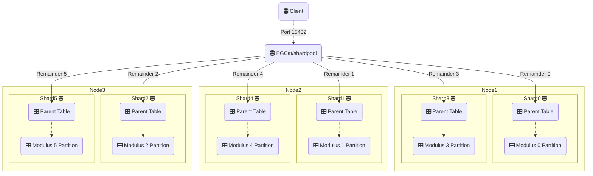

# Sharding por Hash con pgcat

## Sharding por Hash con pgcat

```mermaid
flowchart TD
    POOL(fa:fa-database PGCat/shardpool) 
    CLIENT(fa:fa-database Client) -. Port 15432 .-> POOL 
    POOL -->|Remainder 0| TABLEP0(fa:fa-table Parent Table)
    POOL -->|Remainder 1| TABLEP1(fa:fa-table Parent Table)
    POOL -->|Remainder 2| TABLEP2(fa:fa-table Parent Table)
    POOL -->|Remainder 3| TABLEP3(fa:fa-table Parent Table)
    POOL -->|Remainder 4| TABLEP4(fa:fa-table Parent Table)
    POOL -->|Remainder 5| TABLEP5(fa:fa-table Parent Table)
    subgraph Node1
        subgraph Shard0 fa:fa-database
        TABLEP0 -.-> PART0(fa:fa-table Modulus 0 Partition)
        end
        subgraph Shard3 fa:fa-database
        TABLEP3 -.-> PART3(fa:fa-table Modulus 3 Partition)
        end
    end
    subgraph Node2
        subgraph Shard1 fa:fa-database
        TABLEP1 -.-> PART1(fa:fa-table Modulus 1 Partition)
        end
        subgraph Shard4 fa:fa-database
        TABLEP4 -.-> PART4(fa:fa-table Modulus 4 Partition)
        end
    end
    subgraph Node3
        subgraph Shard2 fa:fa-database
        TABLEP2 -.-> PART2(fa:fa-table Modulus 2 Partition)
        end
        subgraph Shard5 fa:fa-database
        TABLEP5 -.-> PART5(fa:fa-table Modulus 5 Partition)
        end
    end

```
