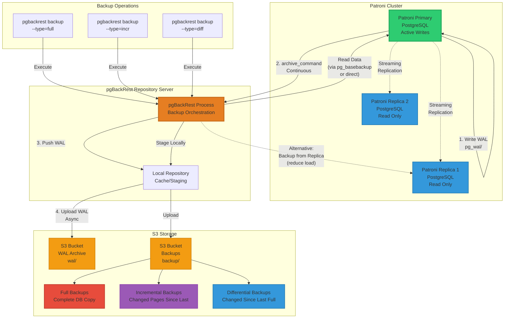
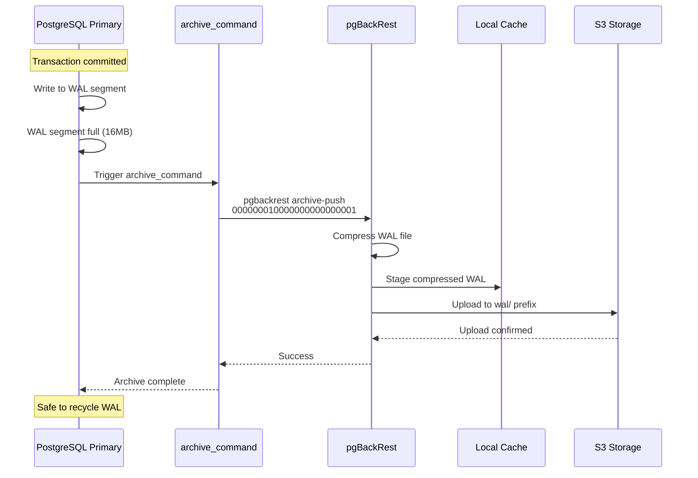
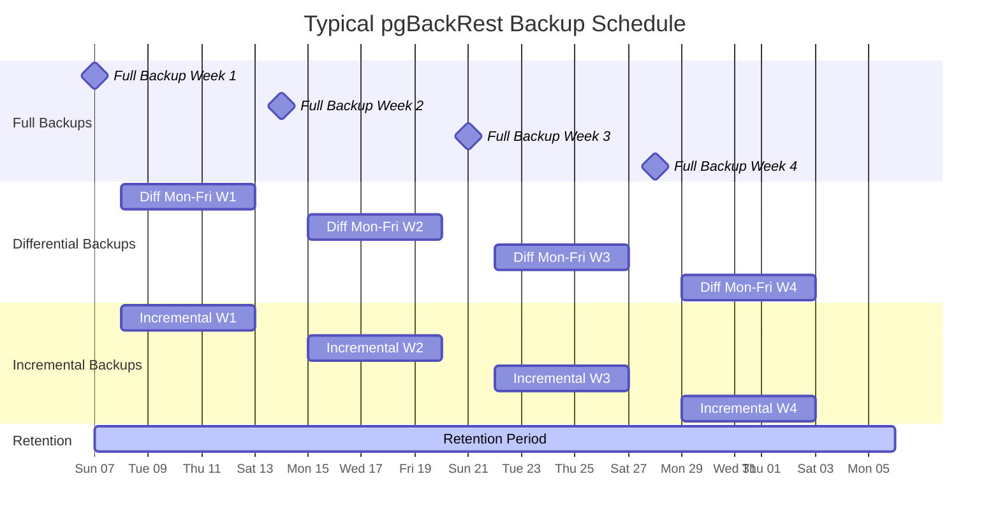
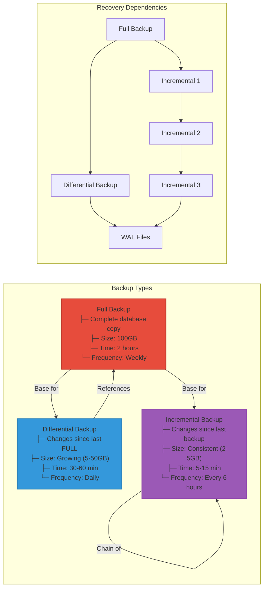
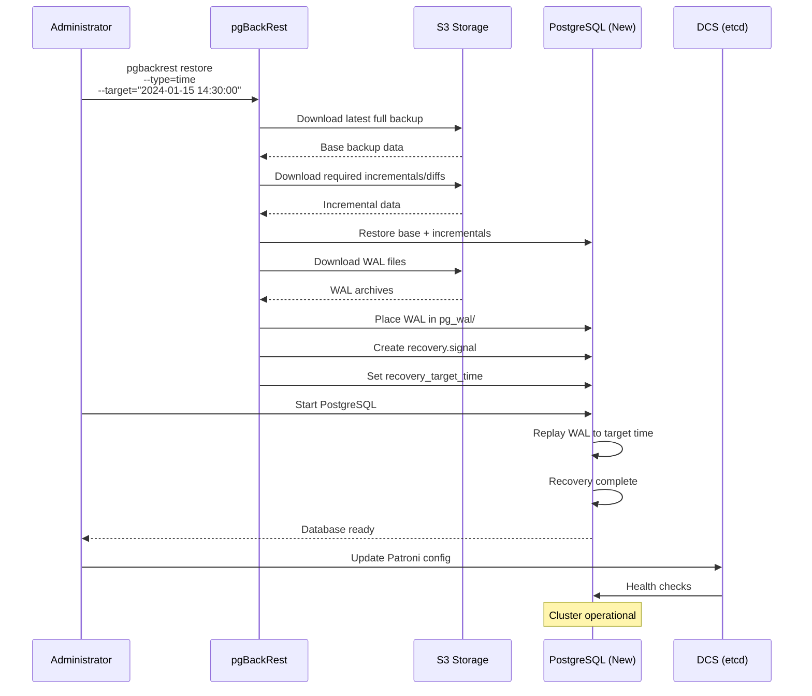
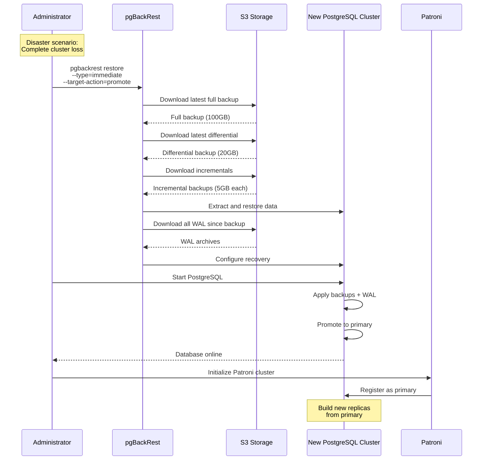
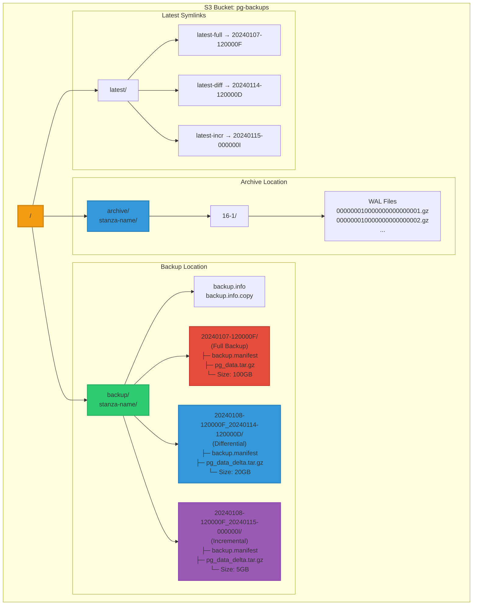

# PostgreSQL Backup Architecture with pgBackRest and S3

Comprehensive backup and recovery architecture using pgBackRest with S3 storage.

## Backup Architecture Overview

## Backup Flow Details

### WAL Archiving Process

## Backup Types and Schedule

## Backup Type Comparison

## Recovery Scenarios

### Point-in-Time Recovery (PITR)

### Disaster Recovery - Full Restore

## S3 Storage Structure

## Key Features

### Backup Strategy Benefits

1. **Full Backup (Weekly)**
   - Complete database snapshot
   - Independent restore point
   - Baseline for differential/incremental

2. **Differential Backup (Daily)**
   - Changes since last full
   - Faster than full backup
   - Quick restore (only need full + latest diff)

3. **Incremental Backup (Every 6 hours)**
   - Smallest backup size
   - Minimal impact on production
   - Requires full chain for restore

### Recovery Capabilities

- **Point-in-Time Recovery (PITR)**: Restore to any moment
- **Parallel Restore**: Fast recovery with multiple processes
- **Delta Restore**: Only restore changed files
- **Tablespace Remapping**: Flexible restore paths
- **Backup from Replica**: Zero impact on primary

### High Availability Features

- **S3 Durability**: 99.999999999% durability
- **Multi-Region Support**: Cross-region replication
- **Encryption**: At-rest and in-transit
- **Compression**: Reduced storage costs
- **Retention Policies**: Automatic cleanup
