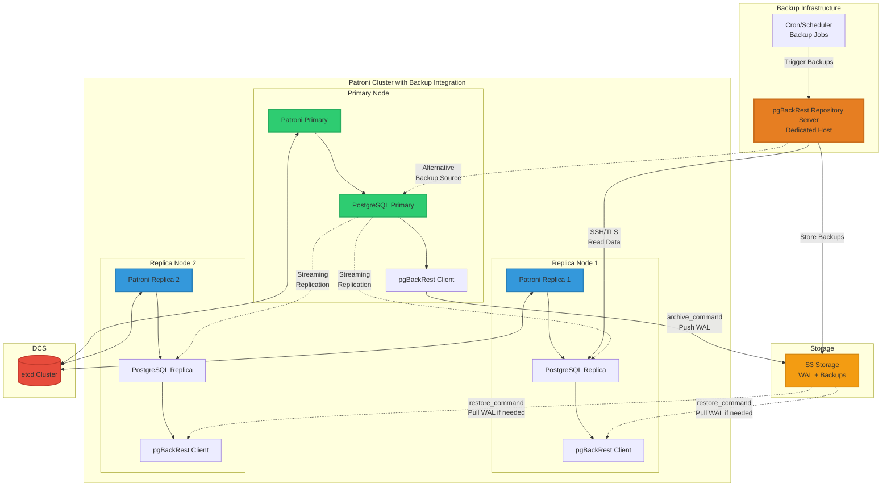
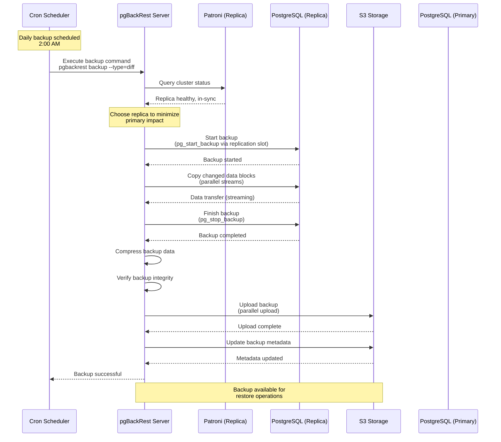
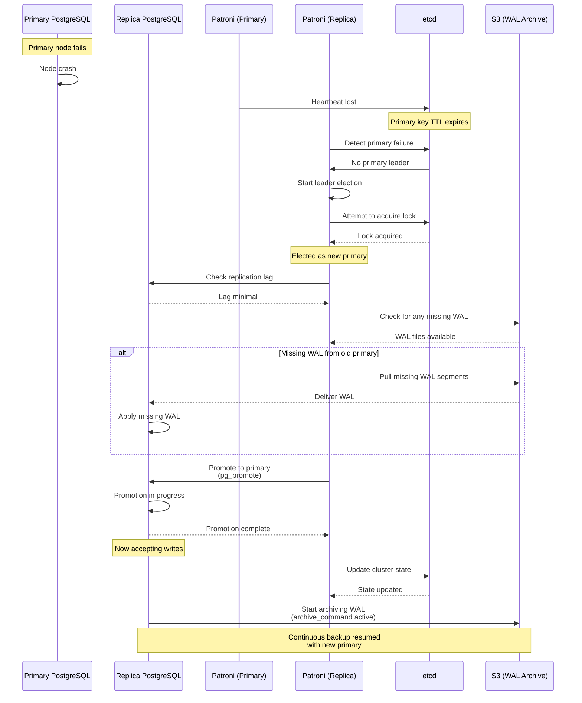
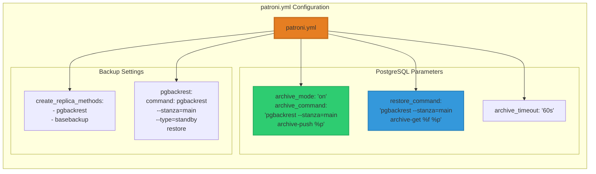
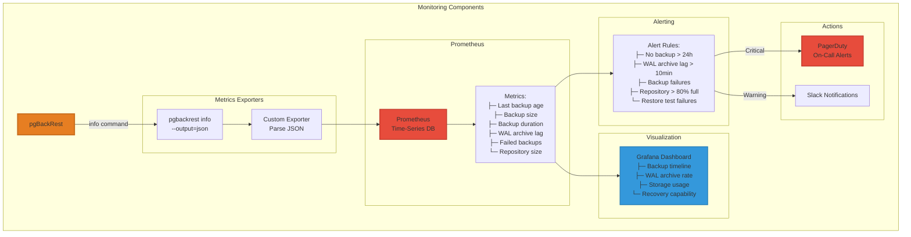
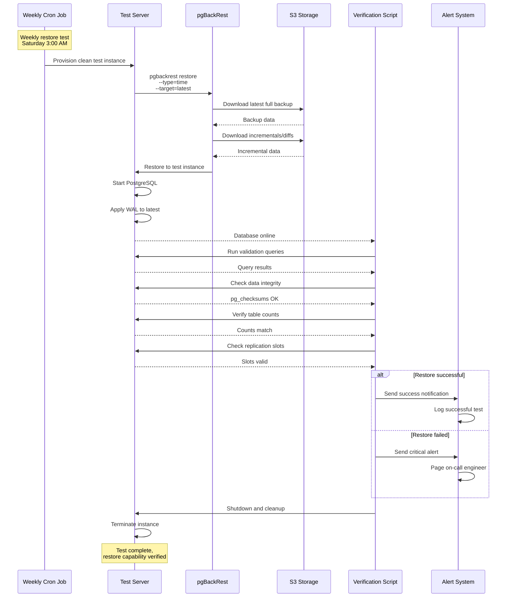

# Patroni + pgBackRest Integration

How pgBackRest integrates with Patroni for automated backup management.

## Patroni Configuration with pgBackRest

## Backup Workflow with Patroni

## Failover Scenario with Backup Integration

## Configuration Files

### Patroni Configuration (patroni.yml)

## Backup Monitoring and Alerts

## Automated Restore Testing

