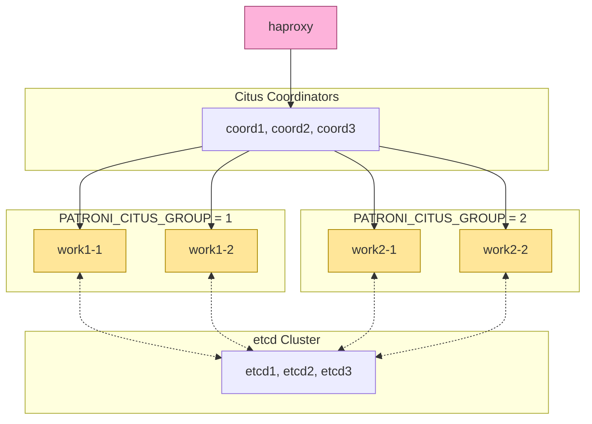

```yaml
# Patroni Citus Support 
# https://github.com/patroni/patroni/blob/master/docs/citus.rst
# Based over https://github.com/patroni/patroni/blob/master/docker-compose-citus.yml

# Define an overlay network for swarm services
networks:
  # demo:
  #   driver: overlay
  swarmlab_net:
    external: true

volumes:
  patroni_data:
  etcd-data1:
  etcd-data2:
  etcd-data3:

# YAML anchors to avoid duplication (optional)
x-etcd-env: &etcd_env
  ETCD_LISTEN_PEER_URLS: "http://0.0.0.0:2380"
  ETCD_LISTEN_CLIENT_URLS: "http://0.0.0.0:2379"
  ETCD_INITIAL_CLUSTER: "etcd1=http://etcd1:2380,etcd2=http://etcd2:2380,etcd3=http://etcd3:2380"
  ETCD_INITIAL_CLUSTER_STATE: "new"
  ETCD_INITIAL_CLUSTER_TOKEN: "tutorial"
  # ETCD_UNSUPPORTED_ARCH: "arm64"

x-haproxy-env: &haproxy_env
  ETCDCTL_ENDPOINTS: "http://etcd1:2379,http://etcd2:2379,http://etcd3:2379"
  PATRONI_ETCD3_HOSTS: "'etcd1:2379','etcd2:2379','etcd3:2379'"
  PATRONI_SCOPE: "swarmlab"
  PATRONI_CITUS_GROUP: "0"
  PATRONI_CITUS_DATABASE: "citus"
  PGSSLMODE: "verify-ca"
  PGSSLKEY: "/etc/ssl/private/ssl-cert-snakeoil.key"
  PGSSLCERT: "/etc/ssl/certs/ssl-cert-snakeoil.pem"
  PGSSLROOTCERT: "/etc/ssl/certs/ssl-cert-snakeoil.pem"

services:
  etcd1:
    image: ${PATRONI_TEST_IMAGE:-patroni-citus}
    networks:
      - swarmlab_net
    environment:
      <<: *etcd_env
    hostname: etcd1
    command: >
      etcd --name etcd1 --initial-advertise-peer-urls http://etcd1:2380
    volumes:
      - etcd-data1:/etcd-data
    deploy:
      restart_policy:
        condition: any
      placement:
        constraints:
          - "node.role == manager"

  etcd2:
    image: ${PATRONI_TEST_IMAGE:-patroni-citus}
    networks:
      - swarmlab_net
    environment:
      <<: *etcd_env
    hostname: etcd2
    command: >
      etcd --name etcd2 --initial-advertise-peer-urls http://etcd2:2380
    volumes:
      - etcd-data2:/etcd-data
    deploy:
      restart_policy:
        condition: any
      placement:
        constraints:
          - "node.role == worker"

  etcd3:
    image: ${PATRONI_TEST_IMAGE:-patroni-citus}
    networks:
      - swarmlab_net
    environment:
      <<: *etcd_env
    hostname: etcd3
    command: >
      etcd --name etcd3 --initial-advertise-peer-urls http://etcd3:2380
    volumes:
      - etcd-data3:/etcd-data    
    deploy:
      restart_policy:
        condition: any
      placement:
        constraints:
          - "node.role == worker"

  haproxy:
    image: haproxy:latest
    hostname: haproxy
    networks:
      - swarmlab_net
    ports:
      - "5000:5000"   # For the batman backend defined in the config
      - "7000:7000"   # For the stats interface defined in the config
    volumes:
      - ./docker/haproxy.cfg:/usr/local/etc/haproxy/haproxy.cfg:ro
    env_file:
      - docker/patroni.env
    environment:
      <<: *haproxy_env
    command: haproxy -f /usr/local/etc/haproxy/haproxy.cfg
    depends_on:
      - coord1
      - coord2
    deploy:
      mode: global
      restart_policy:
        condition: any


  coord1:
    image: ${PATRONI_TEST_IMAGE:-patroni-citus}
    networks:
      - swarmlab_net
    env_file:
      - docker/patroni.env
    hostname: coord1
    environment:
      <<: *haproxy_env
      PATRONI_NAME: "coord1"
      PATRONI_CITUS_DATABASE: "postgres"
    ports:
      - 5432
      - 8008
    deploy:
      restart_policy:
        condition: any
      placement:
        constraints:
          - "node.role == manager"

  coord2:
    image: ${PATRONI_TEST_IMAGE:-patroni-citus}
    networks:
      - swarmlab_net
    env_file:
      - docker/patroni.env
    hostname: coord2
    environment:
      <<: *haproxy_env
      PATRONI_NAME: "coord2"
      PATRONI_CITUS_DATABASE: "postgres"
    ports:
      - 5432
      - 8008
    deploy:
      restart_policy:
        condition: any
      placement:
        constraints:
          - "node.role == worker"

  coord3:
    image: ${PATRONI_TEST_IMAGE:-patroni-citus}
    networks:
      - swarmlab_net
    env_file:
      - docker/patroni.env
    hostname: coord3
    environment:
      <<: *haproxy_env
      PATRONI_NAME: "coord3"
      PATRONI_CITUS_DATABASE: "postgres"
    ports:
      - 5432
      - 8008
    deploy:
      restart_policy:
        condition: any
      placement:
        constraints:
          - "node.role == worker"

  work1-1:
    image: ${PATRONI_TEST_IMAGE:-patroni-citus}
    networks:
      - swarmlab_net
    env_file:
      - docker/patroni.env
    hostname: work1-1
    environment:
      <<: *haproxy_env
      PATRONI_NAME: "work1-1"
      PATRONI_CITUS_GROUP: "1"
      PATRONI_CITUS_DATABASE: "postgres"
    deploy:
      restart_policy:
        condition: any

  work1-2:
    image: ${PATRONI_TEST_IMAGE:-patroni-citus}
    networks:
      - swarmlab_net
    env_file:
      - docker/patroni.env
    hostname: work1-2
    environment:
      <<: *haproxy_env
      PATRONI_NAME: "work1-2"
      PATRONI_CITUS_GROUP: "1"
      PATRONI_CITUS_DATABASE: "postgres"
    volumes:
      - patroni_data:/var/lib/postgresql/data
    deploy:
      restart_policy:
        condition: any

  work2-1:
    image: ${PATRONI_TEST_IMAGE:-patroni-citus}
    networks:
      - swarmlab_net
    env_file:
      - docker/patroni.env
    hostname: work2-1
    environment:
      <<: *haproxy_env
      PATRONI_NAME: "work2-1"
      PATRONI_CITUS_GROUP: "2"
      PATRONI_CITUS_DATABASE: "postgres"
    volumes:
      - patroni_data:/var/lib/postgresql/data
    deploy:
      restart_policy:
        condition: any

  work2-2:
    image: ${PATRONI_TEST_IMAGE:-patroni-citus}
    networks:
      - swarmlab_net
    env_file:
      - docker/patroni.env
    hostname: work2-2
    environment:
      <<: *haproxy_env
      PATRONI_NAME: "work2-2"
      PATRONI_CITUS_GROUP: "2"
      PATRONI_CITUS_DATABASE: "postgres"
    volumes:
      - patroni_data:/var/lib/postgresql/data
    deploy:
      restart_policy:
        condition: any
```



