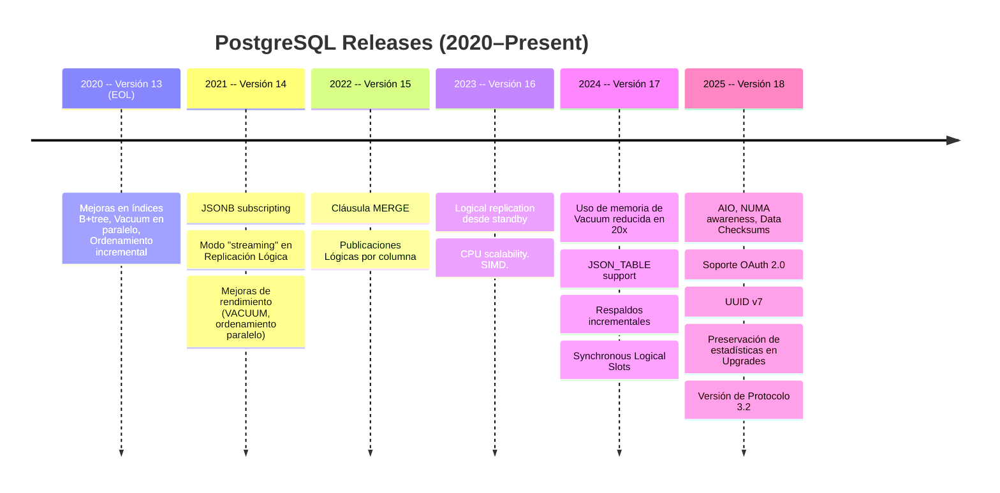

# Feature Timeline

PostgreSQL Feature Timeline, history of releases and features.

## Extended Feature Timeline

```mermaid
timeline
    title PostgreSQL Releases (2020–Present)
        2020 -- Versión 13 (EOL)
             : Mejoras en índices B+tree, Vacuum en paralelo, Ordenamiento incremental
        2021 -- Versión 14
             : JSONB subscripting
             : Modo "streaming" en Replicación Lógica
             : Mejoras de rendimiento (VACUUM, ordenamiento paralelo)
        2022 -- Versión 15
             : Cláusula MERGE
             : Publicaciones Lógicas por columna
        2023 -- Versión 16
             : Logical replication desde standby
             : CPU scalability. SIMD.
        2024 -- Versión 17
             : Uso de memoria de Vacuum reducida en 20x
             : JSON_TABLE support
             : Respaldos incrementales
             : Synchronous Logical Slots
        2025 -- Versión 18
             : AIO, NUMA awareness, Data Checksums
             : Soporte OAuth 2.0
             : UUID v7
             : Preservación de estadísticas en Upgrades
             : Versión de Protocolo 3.2 
```

