# PostgreSQL Fleet Monitoring with Prometheus and Grafana

Comprehensive monitoring architecture for managing multiple PostgreSQL clusters with centralized observability.

## Fleet Monitoring Architecture Overview

```mermaid
graph TB
    subgraph "PostgreSQL Fleet"
        subgraph "Cluster 1 - Production"
            PG1_PRI[Primary Node<br/>postgres_exporter:9187<br/>node_exporter:9100]
            PG1_REP1[Replica 1<br/>postgres_exporter:9187<br/>node_exporter:9100]
            PG1_REP2[Replica 2<br/>postgres_exporter:9187<br/>node_exporter:9100]
            PGB1[PgBouncer Pool<br/>pgbouncer_exporter:9127]
            PAT1[Patroni<br/>/metrics:8008]
        end

        subgraph "Cluster 2 - Analytics"
            PG2_PRI[Primary Node<br/>postgres_exporter:9187<br/>node_exporter:9100]
            PG2_REP1[Replica 1<br/>postgres_exporter:9187<br/>node_exporter:9100]
            PG2_REP2[Replica 2<br/>postgres_exporter:9187<br/>node_exporter:9100]
            PGB2[PgBouncer Pool<br/>pgbouncer_exporter:9127]
            PAT2[Patroni<br/>/metrics:8008]
        end

        subgraph "Cluster 3 - Staging"
            PG3_PRI[Primary Node<br/>postgres_exporter:9187]
            PG3_REP1[Replica 1<br/>postgres_exporter:9187]
            PGB3[PgBouncer<br/>pgbouncer_exporter:9127]
            PAT3[Patroni<br/>/metrics:8008]
        end

        subgraph "Backup Infrastructure"
            PGBR1[pgBackRest Server 1]
            PGBR2[pgBackRest Server 2]
            PGBR_EXP[pgbackrest_exporter:9113]
        end
    end

    subgraph "Metrics Collection Layer"
        subgraph "Regional Prometheus Instances"
            PROM1[Prometheus 1<br/>us-east-1a<br/>Scrape Interval: 15s]
            PROM2[Prometheus 2<br/>us-east-1b<br/>Scrape Interval: 15s]
        end

        subgraph "Service Discovery"
            SD[Service Discovery<br/>├─ Consul<br/>├─ File SD<br/>├─ Kubernetes SD<br/>└─ EC2 SD]
        end
    end

    subgraph "Global Monitoring Platform"
        subgraph "Long-Term Storage"
            THANOS[Thanos Query<br/>Global View<br/>Deduplication]
            THANOS_STORE[Thanos Store<br/>S3 Object Storage<br/>Long-term Metrics]
        end

        subgraph "Alerting"
            ALERT_MGR[Alertmanager<br/>Alert Routing<br/>Deduplication]
            ALERT_RULES["Alert Rules:<br/>├─ High Connection Count<br/>├─ Replication Lag<br/>├─ Disk Usage<br/>├─ Query Performance<br/>├─ Backup Status<br/>└─ Cluster Health"]
        end

        subgraph "Visualization"
            GRAFANA[Grafana<br/>Centralized Dashboards]

            DASH_FLEET["Fleet Overview Dashboard<br/>All Clusters Summary"]
            DASH_CLUSTER["Cluster Dashboard<br/>Per-Cluster Metrics"]
            DASH_NODE["Node Dashboard<br/>Individual PostgreSQL"]
            DASH_QUERY["Query Performance<br/>Slow Queries & Stats"]
            DASH_BACKUP["Backup Dashboard<br/>Backup Status & Health"]
        end

        subgraph "Notification Channels"
            PAGE[PagerDuty<br/>P0/P1 Incidents]
            SLACK[Slack<br/>Team Notifications]
            EMAIL[Email<br/>Daily Reports]
            WEBHOOK[Webhooks<br/>Custom Integrations]
        end
    end

    %% Metrics Collection
    PG1_PRI --> PROM1
    PG1_REP1 --> PROM1
    PG1_REP2 --> PROM1
    PGB1 --> PROM1
    PAT1 --> PROM1

    PG2_PRI --> PROM2
    PG2_REP1 --> PROM2
    PG2_REP2 --> PROM2
    PGB2 --> PROM2
    PAT2 --> PROM2

    PG3_PRI --> PROM1
    PG3_REP1 --> PROM1
    PGB3 --> PROM1
    PAT3 --> PROM1

    PGBR1 --> PGBR_EXP
    PGBR2 --> PGBR_EXP
    PGBR_EXP --> PROM1

    %% Service Discovery
    SD --> PROM1
    SD --> PROM2

    %% Federation
    PROM1 --> THANOS
    PROM2 --> THANOS
    PROM1 --> THANOS_STORE
    PROM2 --> THANOS_STORE

    %% Alerting Flow
    PROM1 --> ALERT_MGR
    PROM2 --> ALERT_MGR
    THANOS --> ALERT_MGR
    ALERT_RULES --> ALERT_MGR

    ALERT_MGR --> PAGE
    ALERT_MGR --> SLACK
    ALERT_MGR --> EMAIL
    ALERT_MGR --> WEBHOOK

    %% Visualization
    THANOS --> GRAFANA
    THANOS_STORE --> GRAFANA

    GRAFANA --> DASH_FLEET
    GRAFANA --> DASH_CLUSTER
    GRAFANA --> DASH_NODE
    GRAFANA --> DASH_QUERY
    GRAFANA --> DASH_BACKUP

    style PG1_PRI fill:#2ecc71,stroke:#27ae60,stroke-width:3px
    style PG2_PRI fill:#2ecc71,stroke:#27ae60,stroke-width:3px
    style PG3_PRI fill:#2ecc71,stroke:#27ae60,stroke-width:3px
    style PROM1 fill:#e67e22,stroke:#ca6f1e,stroke-width:3px
    style PROM2 fill:#e67e22,stroke:#ca6f1e,stroke-width:3px
    style THANOS fill:#e74c3c,stroke:#c0392b,stroke-width:3px
    style GRAFANA fill:#f39c12,stroke:#d68910,stroke-width:3px
    style ALERT_MGR fill:#e74c3c,stroke:#c0392b,stroke-width:2px
```

## Metrics Collection Architecture

## Service Discovery Configuration

```mermaid
graph TB
    subgraph "Service Discovery Methods"
        SD_CONSUL[Consul SD<br/>Dynamic Service Registration]
        SD_FILE[File SD<br/>Static Configuration Files]
        SD_K8S[Kubernetes SD<br/>Pod/Service Discovery]
        SD_EC2[EC2 SD<br/>AWS Instance Discovery]
    end

    subgraph "Target Registration"
        REG["Service Registration:<br/>├─ Cluster: production<br/>├─ Role: primary/replica<br/>├─ Environment: prod/staging<br/>├─ Region: us-east-1<br/>└─ Version: PostgreSQL 16"]
    end

    subgraph "Prometheus"
        PROM[Prometheus Server]

        RELABEL["Relabel Config:<br/>├─ Add cluster label<br/>├─ Add role label<br/>├─ Add environment<br/>└─ Filter by tags"]
    end

    subgraph "Example Consul Service"
        CONSUL_SVC["Service: postgres-exporter<br/>Tags: [primary, prod]<br/>Meta:<br/>  cluster: prod-cluster-1<br/>  region: us-east-1<br/>Address: 10.0.1.10<br/>Port: 9187"]
    end

    SD_CONSUL --> REG
    SD_FILE --> REG
    SD_K8S --> REG
    SD_EC2 --> REG

    REG --> PROM
    PROM --> RELABEL

    CONSUL_SVC --> SD_CONSUL

    style PROM fill:#e67e22,stroke:#ca6f1e,stroke-width:3px
    style SD_CONSUL fill:#3498db,stroke:#2980b9,stroke-width:2px
```

## Prometheus Federation and Storage

## Alerting Pipeline

## Alert Rules Configuration

```mermaid
graph TB
    subgraph "Database Health Alerts"
        DB_ALERTS["Critical Alerts:<br/>├─ PostgreSQL Down<br/>├─ Replication Broken<br/>├─ High Connection Count (>80%)<br/>├─ Too Many Locks<br/>└─ Database Size Critical<br/><br/>Warning Alerts:<br/>├─ Replication Lag >10s<br/>├─ Long Running Queries >5min<br/>├─ High CPU/Memory<br/>├─ Slow Query Rate High<br/>└─ Cache Hit Ratio Low"]
    end

    subgraph "Cluster Health Alerts"
        CLUSTER_ALERTS["Critical Alerts:<br/>├─ Patroni Failover<br/>├─ Split Brain Detected<br/>├─ DCS Unavailable<br/>└─ No Primary in Cluster<br/><br/>Warning Alerts:<br/>├─ Frequent Restarts<br/>├─ Replica Out of Sync<br/>└─ Backup Age >24h"]
    end

    subgraph "System Alerts"
        SYS_ALERTS["Critical Alerts:<br/>├─ Disk >90% Full<br/>├─ Disk I/O Saturated<br/>├─ OOM Kills Detected<br/>└─ Network Errors High<br/><br/>Warning Alerts:<br/>├─ Disk >80% Full<br/>├─ Memory >85%<br/>└─ High Swap Usage"]
    end

    subgraph "Backup Alerts"
        BACKUP_ALERTS["Critical Alerts:<br/>├─ No Backup in 24h<br/>├─ Backup Failed<br/>├─ WAL Archive Lag >15min<br/>└─ Restore Test Failed<br/><br/>Warning Alerts:<br/>├─ Backup Duration Increased<br/>├─ Backup Size Anomaly<br/>└─ S3 Upload Slow"]
    end

    subgraph "Alert Configuration"
        ALERT_CONFIG["Alert Properties:<br/>├─ Evaluation Interval: 15s<br/>├─ For Duration: 5m<br/>├─ Labels: severity, cluster, env<br/>├─ Annotations: description, runbook<br/>└─ External Labels: region, dc"]
    end

    subgraph "Alert Routing"
        ROUTES["Routing Rules:<br/>├─ severity=critical → PagerDuty<br/>├─ severity=warning → Slack<br/>├─ cluster=production → PagerDuty<br/>├─ cluster=staging → Slack<br/>└─ All alerts → Jira"]
    end

    DB_ALERTS --> ALERT_CONFIG
    CLUSTER_ALERTS --> ALERT_CONFIG
    SYS_ALERTS --> ALERT_CONFIG
    BACKUP_ALERTS --> ALERT_CONFIG

    ALERT_CONFIG --> ROUTES

    style DB_ALERTS fill:#e74c3c,stroke:#c0392b,stroke-width:2px
    style CLUSTER_ALERTS fill:#e67e22,stroke:#ca6f1e,stroke-width:2px
    style BACKUP_ALERTS fill:#f39c12,stroke:#d68910,stroke-width:2px
```

## Grafana Dashboard Organization

```mermaid
graph TB
    subgraph "Grafana Organization"
        GRAFANA[Grafana Instance<br/>https://grafana.example.com]

        subgraph "Folder: PostgreSQL Fleet"
            FOLDER_FLEET[Fleet Dashboards]

            DASH1["1. Fleet Overview<br/>├─ All clusters summary<br/>├─ Cluster health matrix<br/>├─ Total connections<br/>├─ Total queries/sec<br/>└─ Alert summary"]

            DASH2["2. Cluster Comparison<br/>├─ Side-by-side metrics<br/>├─ Performance comparison<br/>├─ Resource utilization<br/>└─ Cost analysis"]

            DASH3["3. Capacity Planning<br/>├─ Growth trends<br/>├─ Resource forecasting<br/>├─ Disk usage projection<br/>└─ Connection trends"]
        end

        subgraph "Folder: Cluster Details"
            FOLDER_CLUSTER[Per-Cluster Dashboards]

            DASH4["4. Cluster Overview<br/>├─ Primary/Replica status<br/>├─ Replication lag<br/>├─ Connection pools<br/>├─ Query performance<br/>└─ System resources"]

            DASH5["5. Replication Health<br/>├─ Replication lag timeline<br/>├─ WAL sender/receiver stats<br/>├─ Slot status<br/>└─ Streaming vs WAL shipping"]

            DASH6["6. Query Performance<br/>├─ Slow queries (pg_stat_statements)<br/>├─ Query duration percentiles<br/>├─ Most executed queries<br/>├─ Temporary file usage<br/>└─ Query plans"]
        end

        subgraph "Folder: System Metrics"
            FOLDER_SYSTEM[System Dashboards]

            DASH7["7. Node Metrics<br/>├─ CPU/Memory/Disk<br/>├─ I/O statistics<br/>├─ Network traffic<br/>└─ Process list"]

            DASH8["8. PgBouncer Monitoring<br/>├─ Connection pool usage<br/>├─ Wait time statistics<br/>├─ Database connections<br/>└─ Client connections"]
        end

        subgraph "Folder: Backup & Recovery"
            FOLDER_BACKUP[Backup Dashboards]

            DASH9["9. Backup Status<br/>├─ Last backup age<br/>├─ Backup size trends<br/>├─ WAL archive status<br/>├─ Restore test results<br/>└─ S3 storage usage"]

            DASH10["10. Point-in-Time Recovery<br/>├─ Recovery window<br/>├─ WAL retention<br/>└─ RPO/RTO metrics"]
        end

        subgraph "Folder: Alerts & SLOs"
            FOLDER_ALERTS[Alert Dashboards]

            DASH11["11. Alert Dashboard<br/>├─ Active alerts<br/>├─ Alert history<br/>├─ MTTA/MTTR<br/>└─ Alert frequency"]

            DASH12["12. SLO Dashboard<br/>├─ Availability %<br/>├─ Query latency p99<br/>├─ Error rate<br/>└─ Error budget"]
        end
    end

    GRAFANA --> FOLDER_FLEET
    GRAFANA --> FOLDER_CLUSTER
    GRAFANA --> FOLDER_SYSTEM
    GRAFANA --> FOLDER_BACKUP
    GRAFANA --> FOLDER_ALERTS

    FOLDER_FLEET --> DASH1
    FOLDER_FLEET --> DASH2
    FOLDER_FLEET --> DASH3

    FOLDER_CLUSTER --> DASH4
    FOLDER_CLUSTER --> DASH5
    FOLDER_CLUSTER --> DASH6

    FOLDER_SYSTEM --> DASH7
    FOLDER_SYSTEM --> DASH8

    FOLDER_BACKUP --> DASH9
    FOLDER_BACKUP --> DASH10

    FOLDER_ALERTS --> DASH11
    FOLDER_ALERTS --> DASH12

    style GRAFANA fill:#f39c12,stroke:#d68910,stroke-width:3px
    style DASH1 fill:#2ecc71,stroke:#27ae60,stroke-width:2px
    style DASH4 fill:#3498db,stroke:#2980b9,stroke-width:2px
    style DASH9 fill:#e67e22,stroke:#ca6f1e,stroke-width:2px
    style DASH11 fill:#e74c3c,stroke:#c0392b,stroke-width:2px
```

## Fleet Overview Dashboard Example

```mermaid
graph TB
    subgraph "Fleet Overview Dashboard"
        TITLE["PostgreSQL Fleet Overview<br/>Last updated: 30s ago"]

        subgraph "Top Row - Cluster Status"
            STATUS_GRID["Cluster Health Matrix<br/>┌─────────┬─────────┬─────────┐<br/>│ Prod-1  │ Prod-2  │ Prod-3  │<br/>│ 🟢 UP   │ 🟢 UP   │ 🟢 UP   │<br/>├─────────┼─────────┼─────────┤<br/>│ Staging │ Dev-1   │ Dev-2   │<br/>│ 🟢 UP   │ 🟢 UP   │ 🟡 WARN │<br/>└─────────┴─────────┴─────────┘"]
        end

        subgraph "Second Row - Key Metrics"
            METRIC1["Total Clusters<br/>━━━━━━━━<br/>6<br/>5 healthy, 1 warning"]

            METRIC2["Total Connections<br/>━━━━━━━━<br/>2,847<br/>↑ 5% from 1h ago"]

            METRIC3["Queries per Second<br/>━━━━━━━━<br/>15,234<br/>↑ 12% from 1h ago"]

            METRIC4["Replication Lag<br/>━━━━━━━━<br/>Avg: 45ms<br/>Max: 230ms"]

            METRIC5["Disk Usage<br/>━━━━━━━━<br/>Avg: 67%<br/>Highest: 82%"]

            METRIC6["Active Alerts<br/>━━━━━━━━<br/>3<br/>2 warning, 1 critical"]
        end

        subgraph "Third Row - Graphs"
            GRAPH1["Query Rate by Cluster<br/>(Line Graph - 24h)<br/>━━━━━━━━━━━━━━━<br/>Prod-1: ————<br/>Prod-2: - - - -<br/>Prod-3: ·······"]

            GRAPH2["Connection Count<br/>(Stacked Area - 24h)<br/>━━━━━━━━━━━━━━━<br/>Shows connections<br/>per cluster"]

            GRAPH3["Replication Lag<br/>(Line Graph - 24h)<br/>━━━━━━━━━━━━━━━<br/>All replicas lag<br/>over time"]
        end

        subgraph "Fourth Row - Tables"
            TABLE1["Top 5 Slow Queries (Fleet-wide)<br/>┌──────────────┬─────┬─────────┐<br/>│ Query        │Cluster│ Avg Time│<br/>├──────────────┼─────┼─────────┤<br/>│ SELECT FROM..│Prod1│  2.5s   │<br/>│ UPDATE users.│Prod2│  1.8s   │<br/>└──────────────┴─────┴─────────┘"]

            TABLE2["Backup Status<br/>┌──────────┬────────────┐<br/>│ Cluster  │ Last Backup│<br/>├──────────┼────────────┤<br/>│ Prod-1   │ 2h ago ✓   │<br/>│ Prod-2   │ 3h ago ✓   │<br/>│ Staging  │ 25h ago ⚠  │<br/>└──────────┴────────────┘"]
        end

        subgraph "Fifth Row - Alerts"
            ALERT_LIST["Active Alerts<br/>━━━━━━━━━━━━━━━<br/>🔴 CRITICAL: Prod-3 Disk >90%<br/>🟡 WARNING: Dev-2 High connections<br/>🟡 WARNING: Staging backup overdue"]
        end
    end

    TITLE --> STATUS_GRID

    STATUS_GRID --> METRIC1
    STATUS_GRID --> METRIC2
    STATUS_GRID --> METRIC3
    STATUS_GRID --> METRIC4
    STATUS_GRID --> METRIC5
    STATUS_GRID --> METRIC6

    METRIC1 --> GRAPH1
    METRIC2 --> GRAPH2
    METRIC3 --> GRAPH3

    GRAPH1 --> TABLE1
    GRAPH2 --> TABLE2

    TABLE1 --> ALERT_LIST

    style TITLE fill:#2c3e50,stroke:#34495e,stroke-width:2px,color:#fff
    style STATUS_GRID fill:#2ecc71,stroke:#27ae60,stroke-width:2px
    style METRIC4 fill:#f39c12,stroke:#d68910,stroke-width:2px
    style METRIC6 fill:#e74c3c,stroke:#c0392b,stroke-width:2px
```

## Key Metrics to Monitor

```mermaid
graph TB
    subgraph "Critical Metrics Categories"
        subgraph "Database Metrics"
            DB_CORE["Core Database:<br/>├─ pg_up (database up/down)<br/>├─ pg_database_size_bytes<br/>├─ pg_stat_database_tup_fetched<br/>├─ pg_stat_database_tup_inserted<br/>├─ pg_stat_database_tup_updated<br/>├─ pg_stat_database_tup_deleted<br/>└─ pg_stat_database_conflicts"]

            DB_CONN["Connections:<br/>├─ pg_stat_activity_count<br/>├─ pg_settings_max_connections<br/>├─ pg_stat_activity_max_tx_duration<br/>└─ pg_stat_database_numbackends"]

            DB_LOCK["Locks:<br/>├─ pg_locks_count<br/>├─ pg_stat_database_deadlocks<br/>└─ Lock wait events"]

            DB_REP["Replication:<br/>├─ pg_replication_lag_seconds<br/>├─ pg_stat_replication_pg_wal_lsn_diff<br/>├─ pg_replication_slots_active<br/>└─ pg_stat_replication_state"]
        end

        subgraph "Performance Metrics"
            PERF_QUERY["Query Performance:<br/>├─ pg_stat_statements_calls<br/>├─ pg_stat_statements_mean_exec_time<br/>├─ pg_stat_statements_max_exec_time<br/>├─ pg_stat_statements_stddev_exec_time<br/>└─ pg_stat_statements_rows"]

            PERF_CACHE["Cache Performance:<br/>├─ pg_stat_database_blks_hit<br/>├─ pg_stat_database_blks_read<br/>├─ Cache hit ratio<br/>└─ Shared buffers usage"]

            PERF_IO["I/O Performance:<br/>├─ pg_stat_bgwriter_buffers_checkpoint<br/>├─ pg_stat_bgwriter_buffers_backend<br/>├─ pg_stat_bgwriter_checkpoint_write_time<br/>└─ pg_stat_database_blk_read_time"]
        end

        subgraph "System Metrics"
            SYS_RES["System Resources:<br/>├─ node_cpu_seconds_total<br/>├─ node_memory_MemAvailable_bytes<br/>├─ node_disk_io_time_seconds_total<br/>├─ node_filesystem_avail_bytes<br/>└─ node_network_transmit_bytes_total"]

            SYS_PROC["Process Metrics:<br/>├─ process_cpu_seconds_total<br/>├─ process_resident_memory_bytes<br/>├─ process_open_fds<br/>└─ process_max_fds"]
        end

        subgraph "Patroni Metrics"
            PAT_METRICS["Cluster Health:<br/>├─ patroni_cluster_unlocked<br/>├─ patroni_postgres_running<br/>├─ patroni_primary (0 or 1)<br/>├─ patroni_replica (0 or 1)<br/>├─ patroni_timeline<br/>└─ patroni_xlog_location"]
        end

        subgraph "Backup Metrics"
            BACKUP_METRICS["Backup Status:<br/>├─ pgbackrest_last_full_backup_age<br/>├─ pgbackrest_last_diff_backup_age<br/>├─ pgbackrest_backup_size_bytes<br/>├─ pgbackrest_backup_duration_seconds<br/>└─ pgbackrest_wal_archive_status"]
        end
    end

    style DB_CORE fill:#2ecc71,stroke:#27ae60,stroke-width:2px
    style DB_REP fill:#e74c3c,stroke:#c0392b,stroke-width:2px
    style PERF_QUERY fill:#3498db,stroke:#2980b9,stroke-width:2px
    style PAT_METRICS fill:#9b59b6,stroke:#8e44ad,stroke-width:2px
```

## Monitoring Best Practices

### Collection Strategy
1. **Scrape Intervals**:
   - Critical metrics: 15s
   - Standard metrics: 30s
   - Backup metrics: 5m

2. **Retention**:
   - Prometheus local: 15 days
   - Thanos/Long-term: 2 years
   - Raw data: 15 days
   - 5m downsampled: 90 days
   - 1h downsampled: 2 years

3. **High Availability**:
   - Multiple Prometheus instances per region
   - Thanos for global view and deduplication
   - Alertmanager clustering for redundancy

### Alert Design
1. **Severity Levels**:
   - **Critical**: Immediate action required (page on-call)
   - **Warning**: Attention needed (Slack notification)
   - **Info**: For awareness (logging only)

2. **Alert Timing**:
   - Evaluation interval: 15s
   - For duration: 5m (avoid flapping)
   - Resolve delay: 5m

3. **Runbooks**:
   - Every alert links to runbook
   - Includes investigation steps
   - Contains remediation procedures

### Dashboard Design
1. **Progressive Detail**:
   - Fleet overview → Cluster view → Node detail
   - Summary metrics → Detailed graphs
   - Real-time → Historical trends

2. **Standardization**:
   - Consistent color schemes
   - Common time ranges
   - Shared variable templates

3. **Performance**:
   - Limit queries per dashboard
   - Use recording rules for complex queries
   - Optimize time ranges

## Key Components Summary

| Component | Purpose | Key Features |
|-----------|---------|--------------|
| **postgres_exporter** | Database metrics | pg_stat tables, replication, locks |
| **node_exporter** | System metrics | CPU, memory, disk, network |
| **pgbouncer_exporter** | Connection pool | Pool size, client/server connections |
| **Patroni metrics** | Cluster health | Leader status, failover events |
| **Prometheus** | Metrics storage | Time-series DB, alerting rules |
| **Thanos** | Global view | Multi-cluster aggregation, long-term storage |
| **Alertmanager** | Alert routing | Deduplication, silencing, routing |
| **Grafana** | Visualization | Dashboards, graphs, tables |

