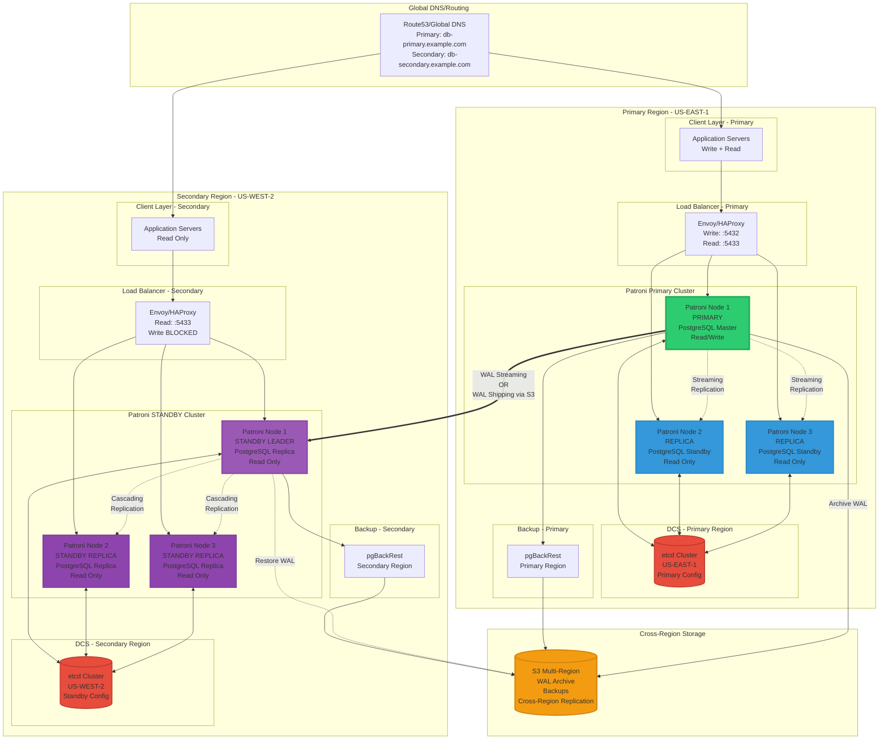
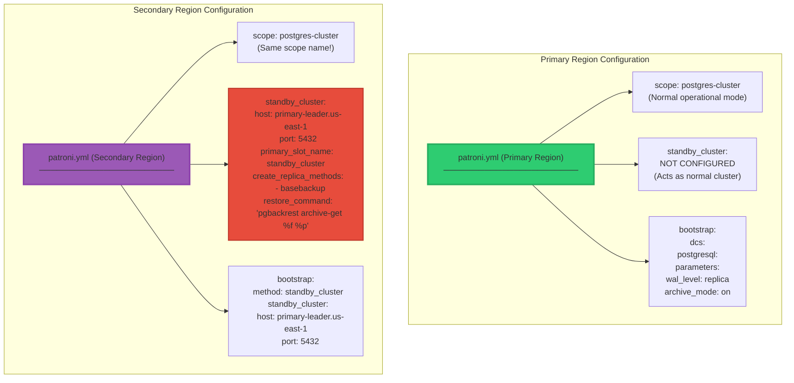
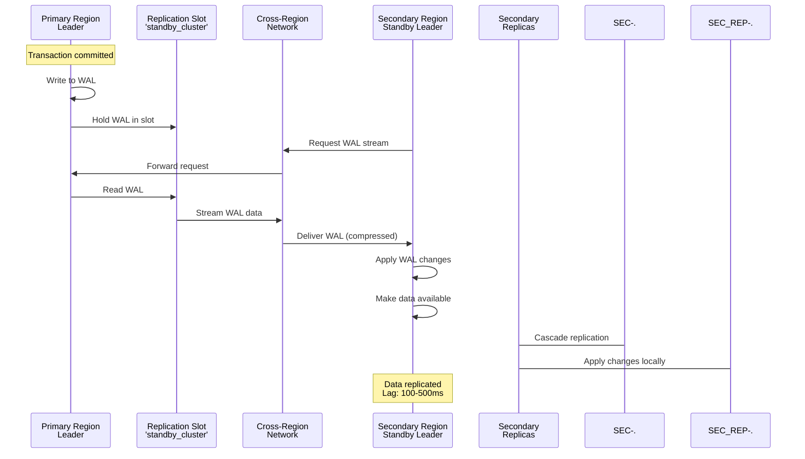
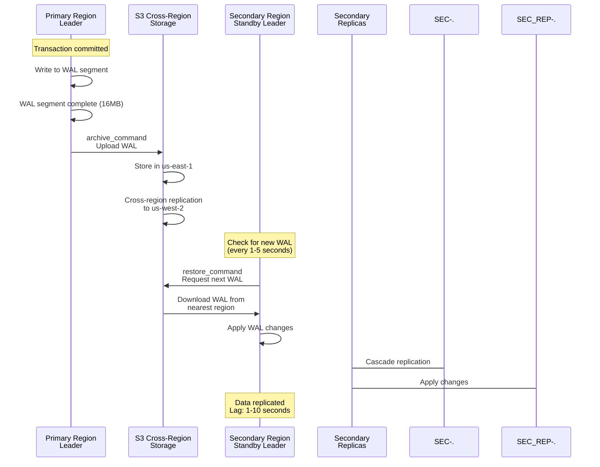
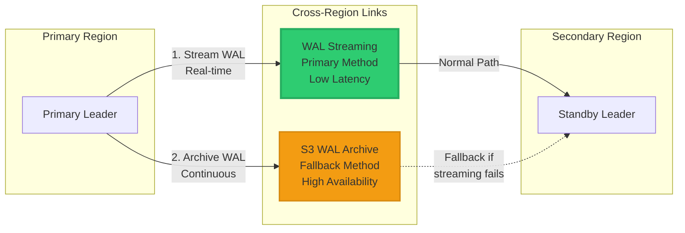
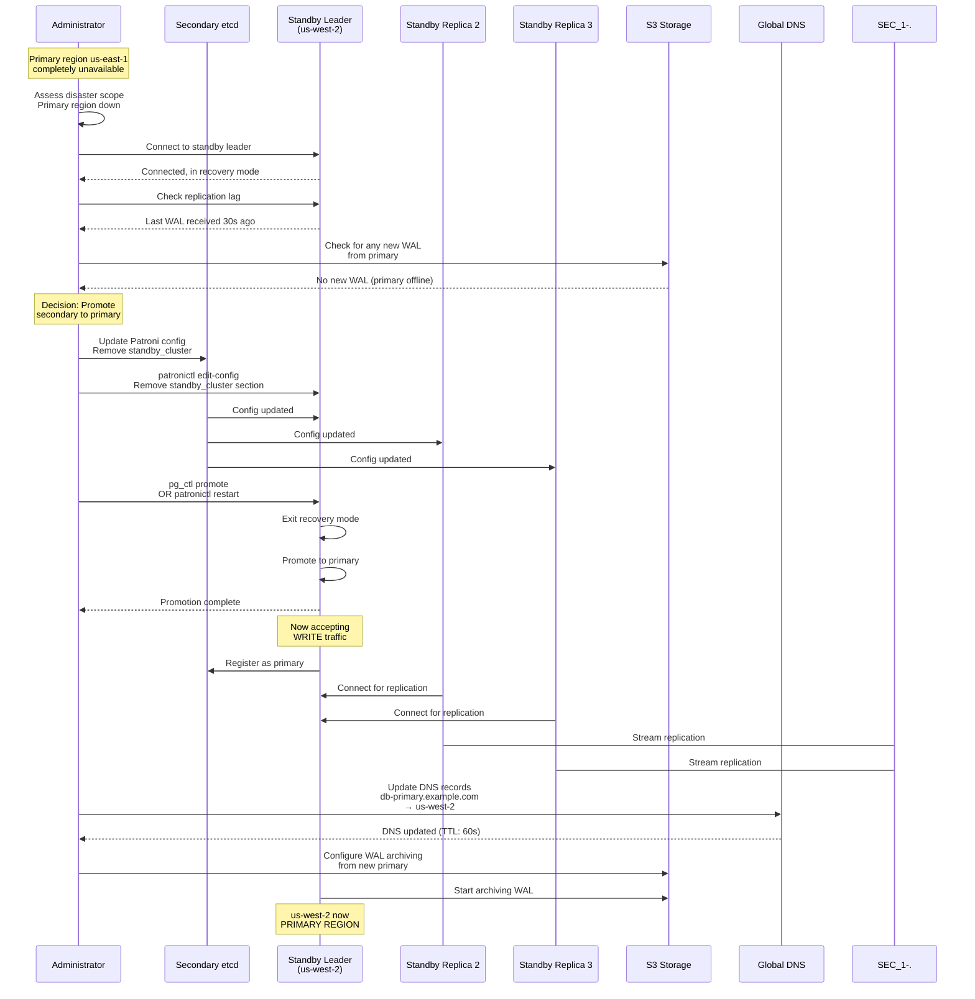
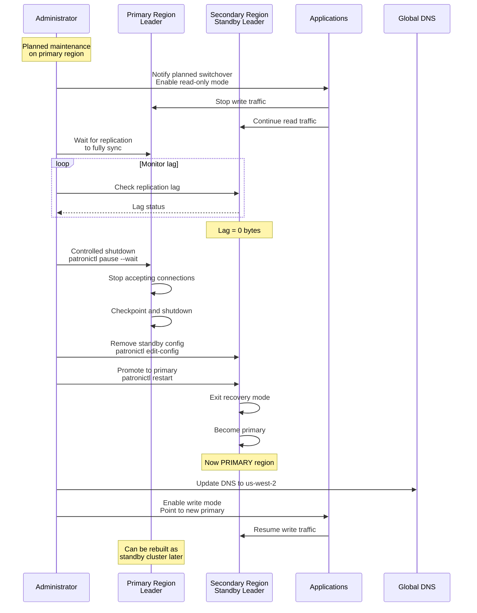
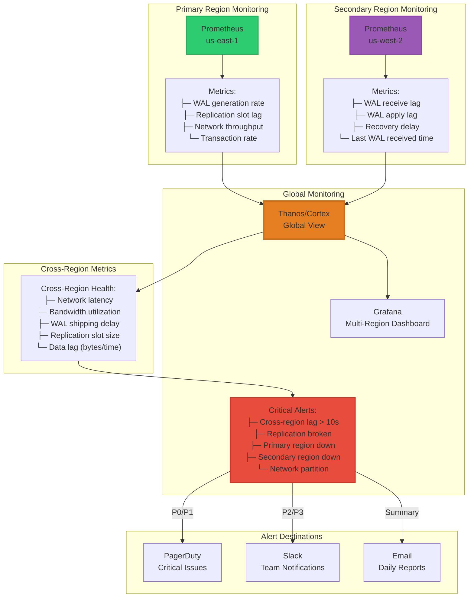
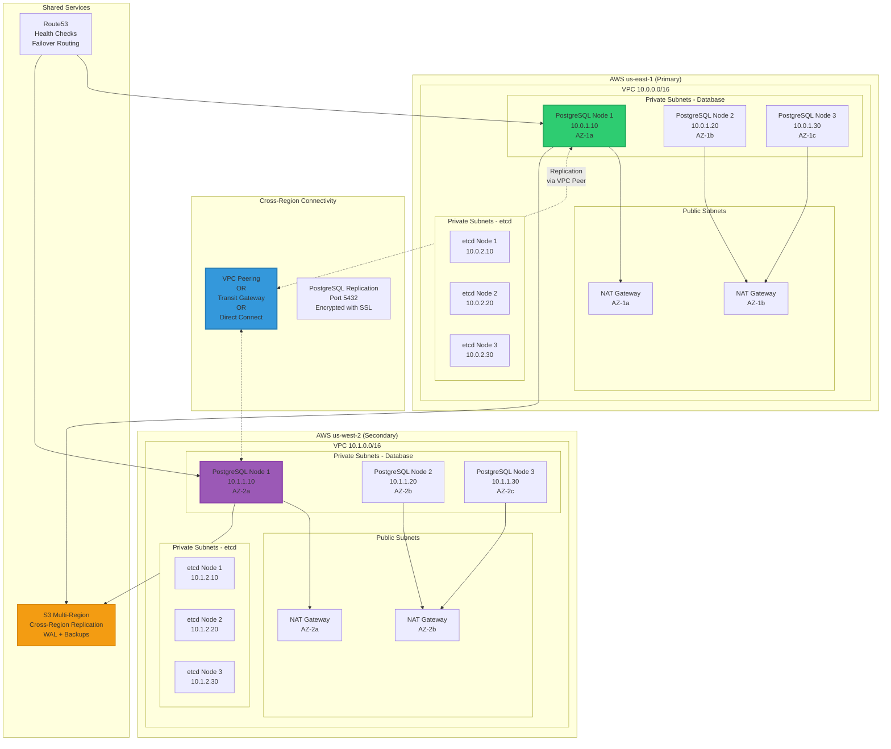
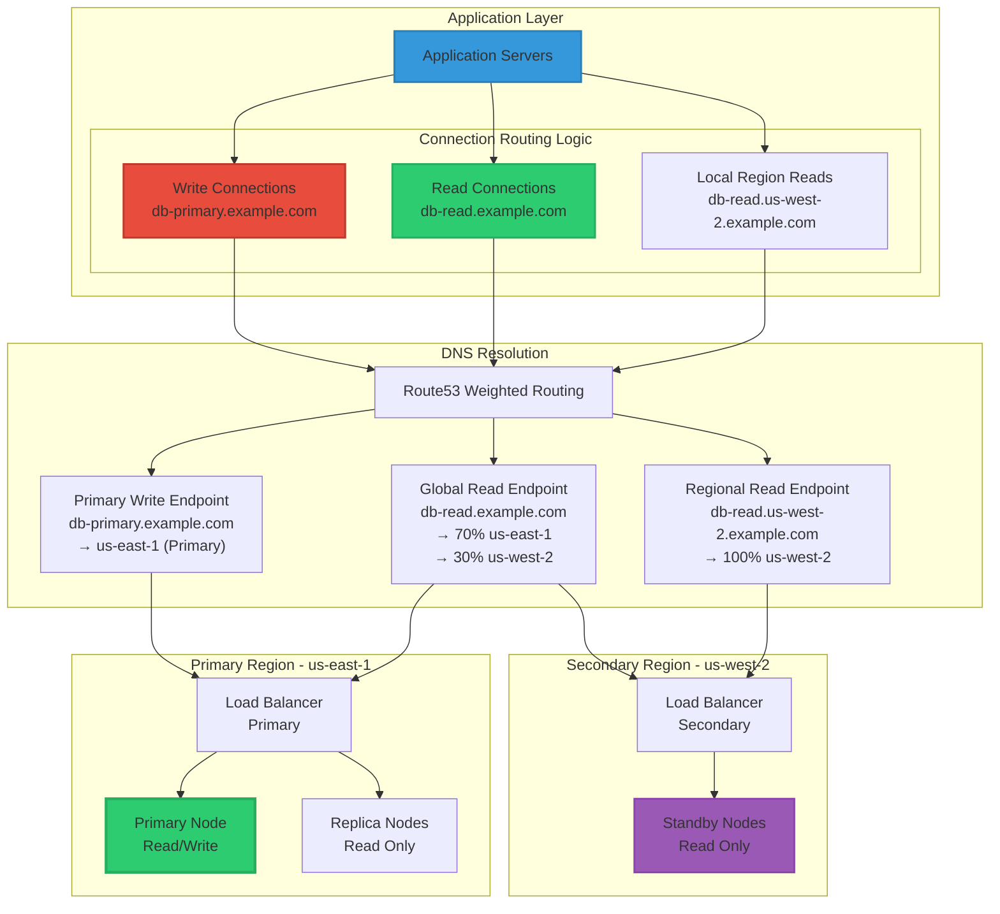

# PostgreSQL Multi-Region Architecture with Patroni Standby Cluster

Comprehensive multi-region setup with primary region cluster and secondary region standby cluster for disaster recovery.

## Multi-Region Architecture Overview

## Patroni Configuration Differences

## Cross-Region Replication Methods

### Method 1: WAL Streaming (Recommended)

### Method 2: WAL Shipping via S3

### Method 3: Hybrid (Streaming + S3 Fallback)

## Disaster Recovery - Region Failover

### Scenario: Primary Region Failure

### Scenario: Planned Switchover

## Monitoring Multi-Region Setup

## Network Architecture

## Application Routing Patterns

## Key Features

### Primary Region
- **Full Patroni Cluster**: Normal operational mode with automatic failover
- **Read-Write Access**: Handles all write operations
- **Local Replication**: Streaming replication between local nodes
- **WAL Archiving**: Continuous archiving to S3
- **WAL Streaming**: Real-time streaming to secondary region

### Secondary Region
- **Standby Cluster Mode**: Entire cluster in recovery/read-only mode
- **Cascading Replication**: Standby leader replicates to local standbys
- **Read-Only Access**: Can serve read queries with some lag
- **Independent DCS**: Separate etcd cluster for local management
- **Disaster Recovery**: Can be promoted to primary during disaster

### Benefits
1. **Geographic Redundancy**: Complete region-level disaster recovery
2. **Low RTO**: Secondary region can be promoted in minutes
3. **Read Scaling**: Distribute read load across multiple regions
4. **Independent Operations**: Secondary cluster manages local replicas independently
5. **Flexible Failover**: Can promote secondary to primary when needed
6. **Data Protection**: Multiple copies across regions with continuous backups

### Important Considerations
1. **Replication Lag**: Cross-region lag typically 100ms-10s depending on method
2. **Network Costs**: Cross-region data transfer has associated costs
3. **Consistency**: Secondary region reads may be slightly behind primary
4. **Failover Impact**: Promotion requires configuration changes and brief downtime
5. **Slot Management**: Replication slots prevent WAL removal until consumed
6. **Monitoring**: Critical to monitor cross-region replication health
