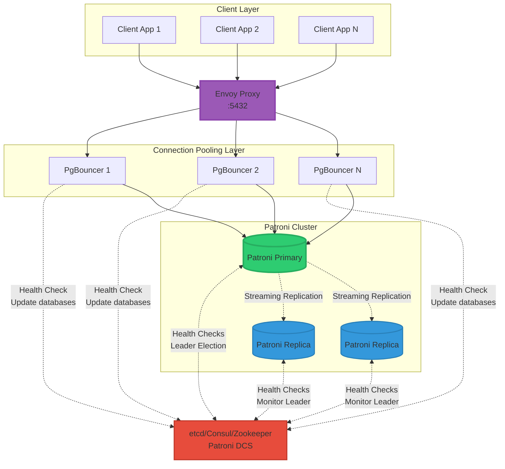
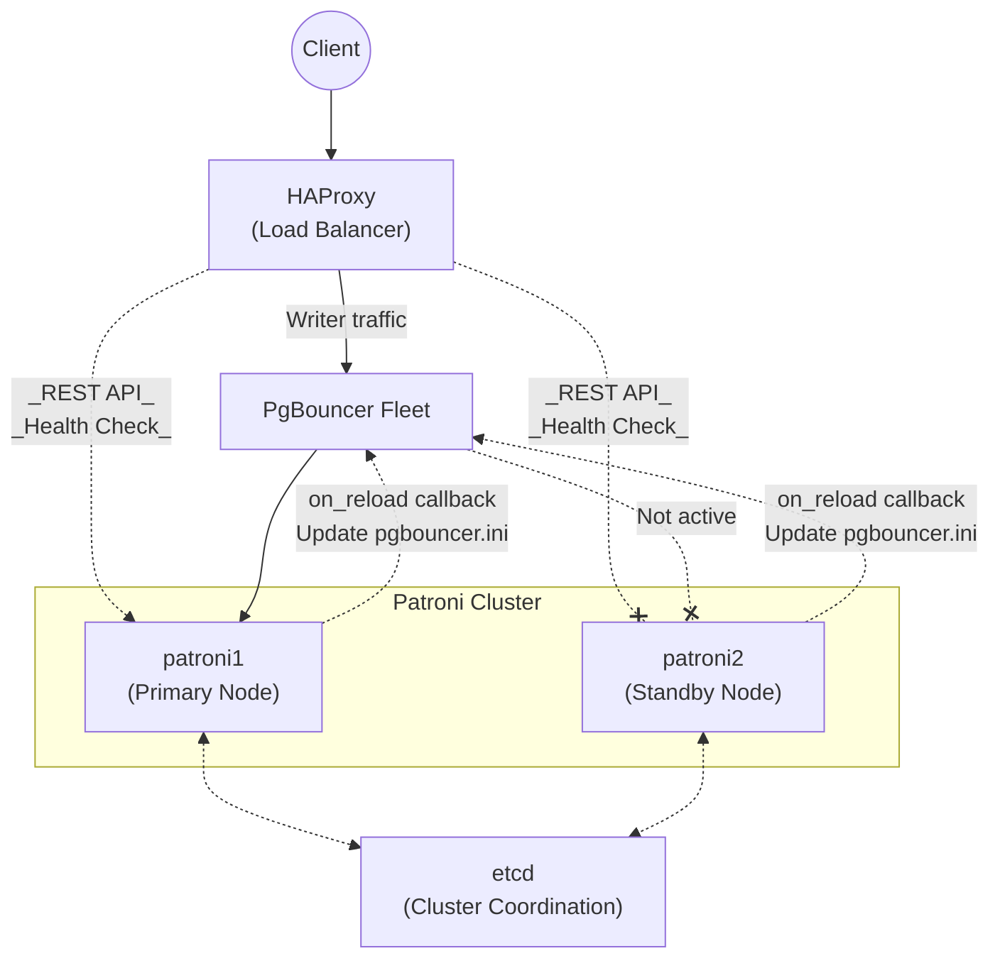
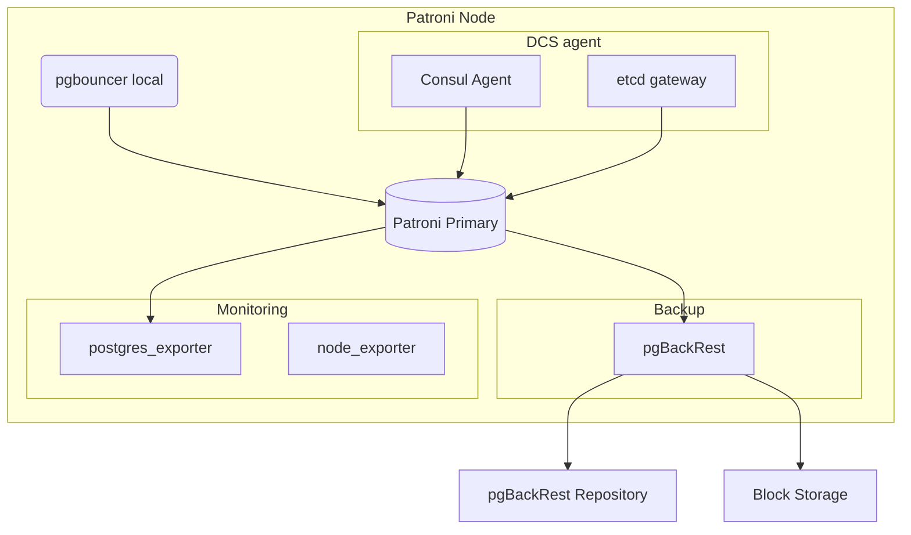

# PostgreSQL with Patroni, Envoy, and PgBouncer Fleet

Basic production setup with high availability and connection pooling.

```mermaid
graph TB
    subgraph "Client Layer"
        C1[Client App 1]
        C2[Client App 2]
        C3[Client App N]
    end

    Envoy[Envoy Proxy<br/>:5432]

    DCS[etcd/Consul/Zookeeper<br/>Patroni DCS]

    subgraph "Connection Pooling Layer"
        PGB1[PgBouncer 1]
        PGB2[PgBouncer 2]
        PGB4[PgBouncer N]
    end

    subgraph "Patroni Cluster"
        PAT1[("Patroni Primary")]
        PAT2[("Patroni Replica")]
        PAT3[("Patroni Replica")]
    end

    PAT1 <-.->|Health Checks<br/>Leader Election| DCS
    PAT2 <-.->|Health Checks<br/>Monitor Leader| DCS
    PAT3 <-.->|Health Checks<br/>Monitor Leader| DCS

    PGB1 -.->|Health Check<br/>Update databases| DCS
    PGB2 -.->|Health Check<br/>Update databases| DCS
    PGB4 -.->|Health Check<br/>Update databases| DCS
    
    C1 --> Envoy
    C2 --> Envoy
    C3 --> Envoy

    Envoy --> PGB1
    Envoy --> PGB2
    Envoy --> PGB4

    PGB1 --> PAT1
    PGB2 --> PAT1
    PGB4 --> PAT1

    PAT1 -.->|Streaming Replication| PAT2
    PAT1 -.->|Streaming Replication| PAT3


    style PAT1 fill:#2ecc71,stroke:#27ae60,stroke-width:3px
    style PAT2 fill:#3498db,stroke:#2980b9,stroke-width:2px
    style PAT3 fill:#3498db,stroke:#2980b9,stroke-width:2px
    style Envoy fill:#9b59b6,stroke:#8e44ad,stroke-width:3px
    style DCS fill:#e74c3c,stroke:#c0392b,stroke-width:2px
```

## Basic Patroni w/Pgbouncer as Entrypoint

```mermaid
flowchart TD
    HAProxy["HAProxy<br/>(Load Balancer)"]
    
    etcd["etcd<br/>(Cluster Coordination)"]
    pgbouncer["PgBouncer Fleet"]
    
    subgraph "Patroni Cluster"
        patroni1["patroni1<br/>(Primary Node)"]
        patroni2["patroni2<br/>(Standby Node)"]    
    end

    Client((Client))
    Client --> HAProxy

    HAProxy -->  |Writer traffic| pgbouncer

    HAProxy -.->|_REST API_ <br />_Health Check_| patroni1
    HAProxy -.-x|_REST API_ <br />_Health Check_| patroni2


    patroni1-.-> |on_reload callback <br/>Update pgbouncer.ini| pgbouncer
    patroni2-.-> |on_reload callback <br/>Update pgbouncer.ini| pgbouncer
    pgbouncer --> patroni1
    pgbouncer -.-x|Not active| patroni2
    patroni1 <-.-> etcd
    patroni2 <-.-> etcd
```

## Nodo de Patroni

```mermaid
graph TD
    subgraph "Patroni Node"
        Primary[("Patroni Primary")]
        pgbouncer(pgbouncer local)
        subgraph "Backup"
            pgBackRest[pgBackRest]
        end
        subgraph "Monitoring"
            pgexporter[postgres_exporter]
            nodeexporter[node_exporter]
        end
        subgraph "DCS agent"
            consul[Consul Agent]
            etcd[etcd gateway]
        end
    end

    Primary --> pgBackRest
    pgbouncer --> Primary
    consul --> Primary
    etcd --> Primary
    pgBackRest --> pgbackrestrepo[pgBackRest Repository]
    pgBackRest --> S3[Block Storage]
    Primary --> pgexporter
```

