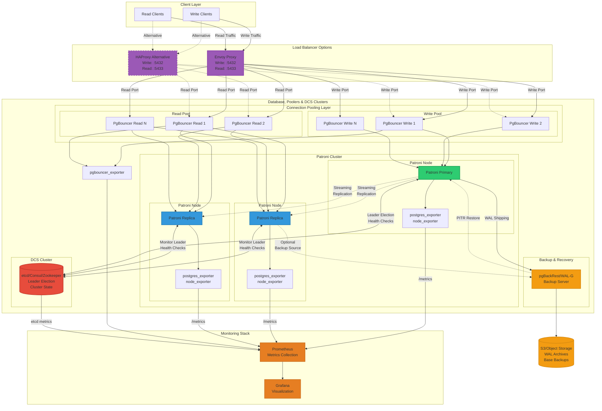

# PostgreSQL Production Architecture

Comprehensive production setup with Patroni, load balancing, connection pooling, monitoring, and backups.

## Architecture Components

### Load Balancing
- **Envoy Proxy** (primary): Modern cloud-native proxy with advanced routing
- **HAProxy** (alternative): Proven high-performance TCP/HTTP load balancer
- Separate ports for write (5432) and read (5433) traffic

### Connection Pooling
- **Write Pool**: Dedicated PgBouncer instances routing to primary
- **Read Pool**: Dedicated PgBouncer instances routing to replicas
- Reduces connection overhead and improves database performance

### Database Cluster
- **Patroni Primary**: Handles all writes and can serve reads
- **Patroni Replicas**: Handle read-only queries for horizontal scaling
- **Streaming Replication**: Near real-time data synchronization
- **Automatic Failover**: Patroni promotes replica to primary on failure

### High Availability
- **DCS (etcd/Consul/Zookeeper)**: Distributed consensus for leader election
- Automatic failover with minimal downtime
- Health checks and cluster state management

### Backup & Recovery
- **pgBackRest/WAL-G**: Enterprise backup solutions
- **S3/Object Storage**: Durable, scalable backup storage
- **WAL Archiving**: Continuous backup of transaction logs
- **Point-in-Time Recovery (PITR)**: Restore to any point in time

### Monitoring Stack
- **Prometheus**: Time-series metrics collection
- **Grafana**: Visualization and alerting dashboards
- **postgres_exporter**: PostgreSQL metrics (connections, queries, locks, etc.)
- **pgbouncer_exporter**: Connection pool metrics
- **Patroni metrics**: Cluster health and replication lag

## Features

- **High Availability**: Automatic failover with Patroni and DCS
- **Read Scaling**: Load distribution across replicas
- **Connection Efficiency**: PgBouncer fleet reduces database connection overhead
- **Disaster Recovery**: Continuous backups with PITR capability
- **Full Observability**: Comprehensive metrics and dashboards
- **Flexible Load Balancing**: Choice of Envoy or HAProxy
- **Traffic Segregation**: Separate read/write routing paths
