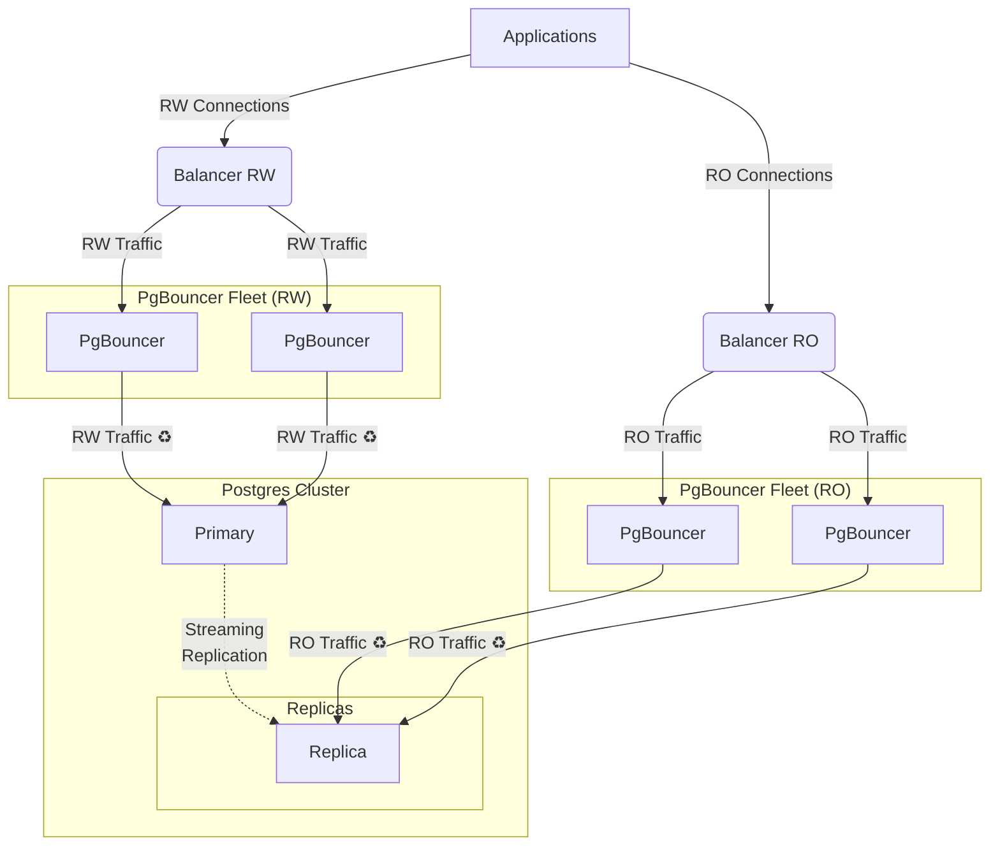
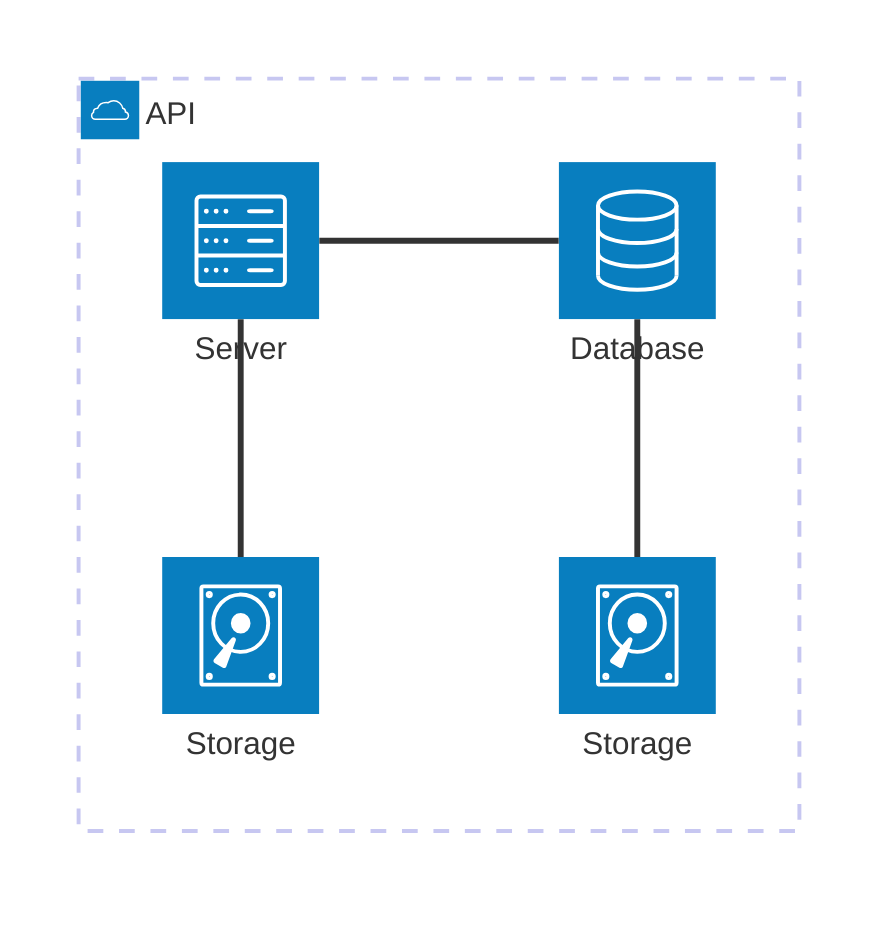

# Pooling Fleet

```mermaid
graph TD
    apps["Applications"]

    BalancerRW(Balancer RW)
    BalancerRO(Balancer RO)
    apps --> |RW Connections| BalancerRW
    apps --> |RO Connections| BalancerRO

    subgraph "PgBouncer Fleet (RW)"
        pgb_rw1["PgBouncer"]
        pgb_rw2["PgBouncer"]
    end

    subgraph "PgBouncer Fleet (RO)"
        pgb_ro1["PgBouncer"]
        pgb_ro2["PgBouncer"]
    end

    subgraph "Postgres Cluster"
      Primary
      subgraph "Replicas"
        Replica
      end
      Primary -.->|Streaming <br/>Replication| Replica
    end

    BalancerRW --> |RW Traffic| pgb_rw1
    BalancerRW --> |RW Traffic| pgb_rw2
    BalancerRO --> |RO Traffic| pgb_ro1
    BalancerRO --> |RO Traffic| pgb_ro2

    pgb_rw1 --> |RW Traffic ♻️| Primary
    pgb_rw2 --> |RW Traffic ♻️| Primary
    pgb_ro1 --> |RO Traffic ♻️| Replica
    pgb_ro2 --> |RO Traffic ♻️| Replica
```

```mermaid
architecture-beta
    group api(cloud)[API]

    service db(database)[Database] in api
    service disk1(disk)[Storage] in api
    service disk2(disk)[Storage] in api
    service server(server)[Server] in api

    db:L -- R:server
    disk1:T -- B:server
    disk2:T -- B:db
```

