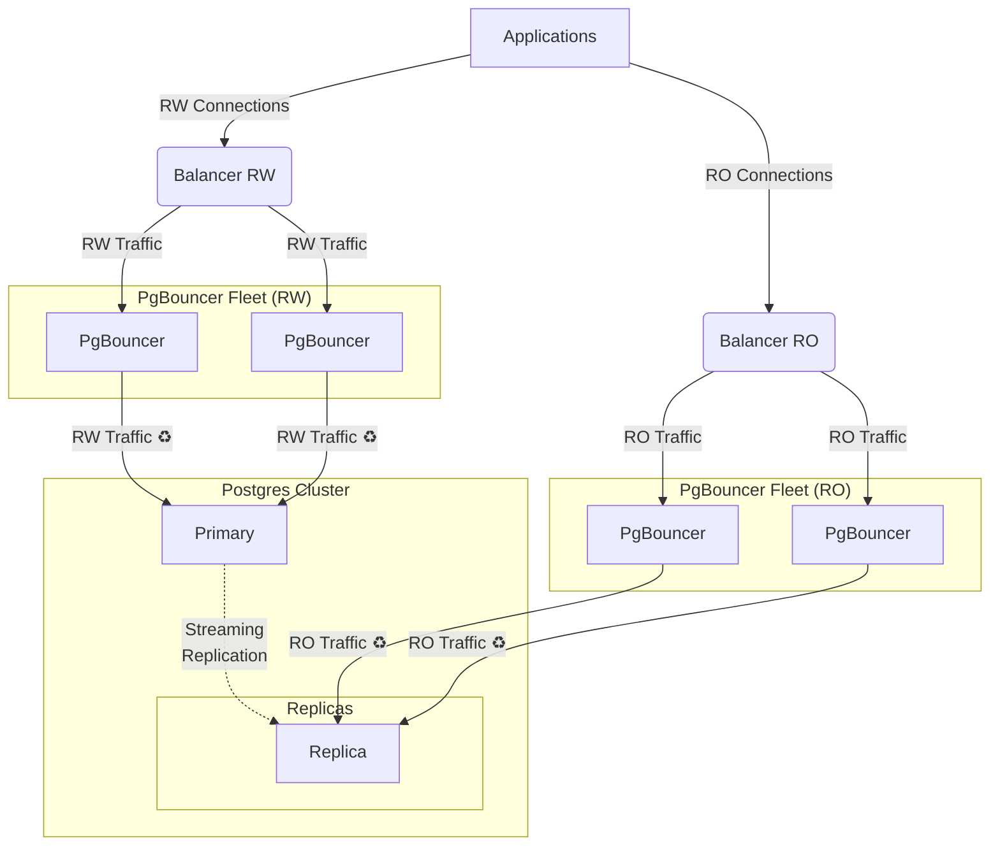
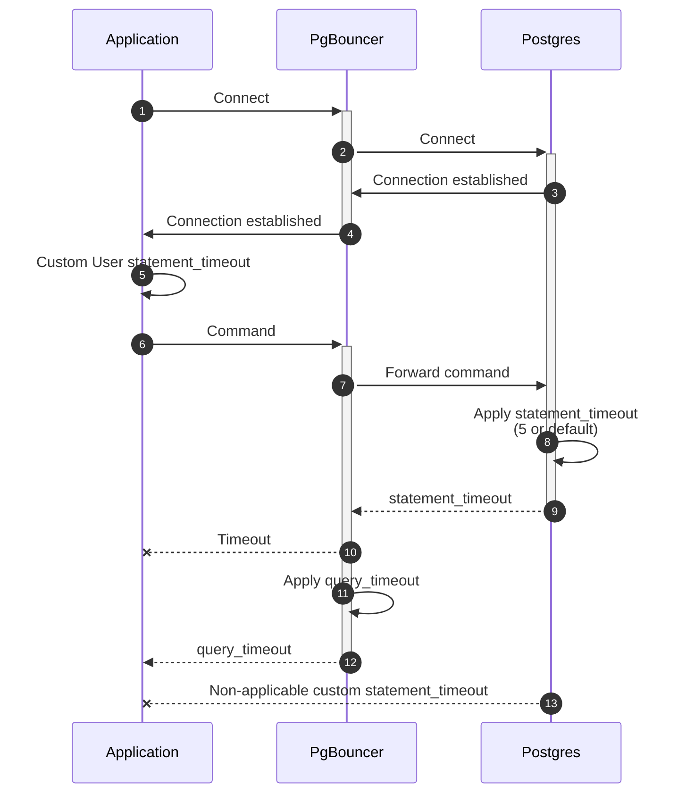
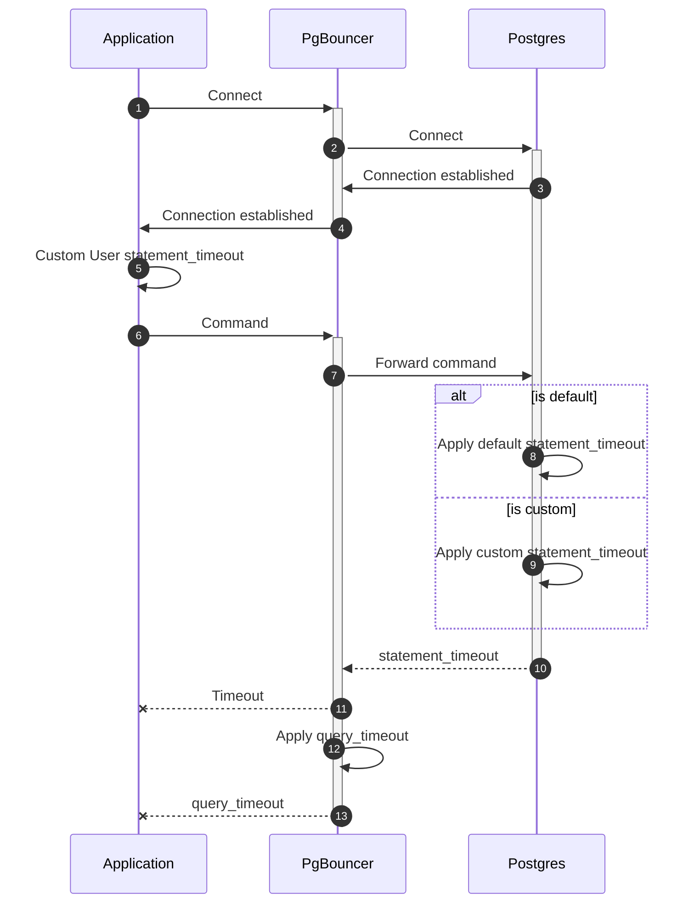

# Pooling Fleet

```mermaid
graph TD
    apps["Applications"]

    BalancerRW(Balancer RW)
    BalancerRO(Balancer RO)
    apps --> |RW Connections| BalancerRW
    apps --> |RO Connections| BalancerRO

    subgraph "PgBouncer Fleet (RW)"
        pgb_rw1["PgBouncer"]
        pgb_rw2["PgBouncer"]
    end

    subgraph "PgBouncer Fleet (RO)"
        pgb_ro1["PgBouncer"]
        pgb_ro2["PgBouncer"]
    end

    subgraph "Postgres Cluster"
      Primary
      subgraph "Replicas"
        Replica
      end
      Primary -.->|Streaming <br/>Replication| Replica
    end

    BalancerRW --> |RW Traffic| pgb_rw1
    BalancerRW --> |RW Traffic| pgb_rw2
    BalancerRO --> |RO Traffic| pgb_ro1
    BalancerRO --> |RO Traffic| pgb_ro2

    pgb_rw1 --> |RW Traffic ♻️| Primary
    pgb_rw2 --> |RW Traffic ♻️| Primary
    pgb_ro1 --> |RO Traffic ♻️| Replica
    pgb_ro2 --> |RO Traffic ♻️| Replica
```

## Timeouts en cascada

```mermaid
sequenceDiagram
    autonumber
    participant Application
    participant PgBouncer
    participant Postgres

    Application->>+PgBouncer: Connect 
    PgBouncer->>+Postgres: Connect 
    
    Postgres->>PgBouncer: Connection established
    PgBouncer->>-Application: Connection established

    Application->>Application: Custom User statement_timeout    
    Application->>+PgBouncer: Command
    PgBouncer->>Postgres: Forward command
    
    Postgres->>Postgres: Apply statement_timeout<br/>(5 or default)
    Postgres-->>-PgBouncer: statement_timeout

    PgBouncer--X Application: Timeout
    PgBouncer->>PgBouncer: Apply query_timeout


    PgBouncer-->>-Application: query_timeout
    Postgres--X Application: Non-applicable custom statement_timeout

```

Custom `query_timeout` for specific queries. 

```mermaid
sequenceDiagram
    autonumber
    participant Application
    participant PgBouncer
    participant Postgres

    Application->>+PgBouncer: Connect 
    PgBouncer->>+Postgres: Connect 
    
    Postgres->>PgBouncer: Connection established
    PgBouncer->>-Application: Connection established

    Application->>Application: Custom User statement_timeout    
    Application->>+PgBouncer: Command
    PgBouncer->>Postgres: Forward command
    
    alt is default
        Postgres->>Postgres: Apply default statement_timeout

    else is custom
        Postgres->>Postgres: Apply custom statement_timeout
    end
    Postgres-->>-PgBouncer: statement_timeout
    PgBouncer--X Application: Timeout

    PgBouncer->> PgBouncer: Apply query_timeout

    PgBouncer--X- Application: query_timeout

```

