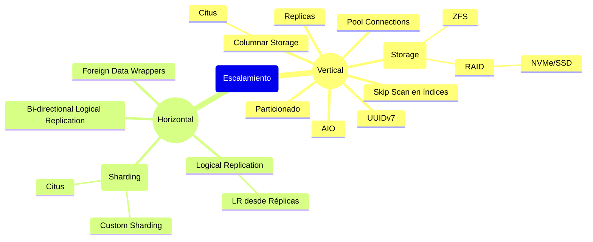

# Diagramas Generales

## Mindmap

```mermaid
mindmap
  root(Escalamiento)
    Vertical((Vertical))
      AIO
      Particionado
      UUIDv7 
      Replicas
      Pool Connections
      Skip Scan en índices
      Columnar Storage
        Citus
      Storage(Storage)
        RAID
          NVMe/SSD
        ZFS
    Horizontal((Horizontal))  
      Logical Replication
        LR desde Réplicas
      Bi-directional Logical Replication
      Sharding(Sharding)
        Citus
        Custom Sharding
      Foreign Data Wrappers
```

