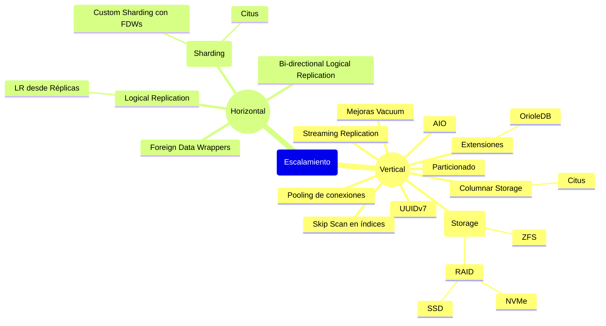

# Diagramas Generales

## Mindmap

```mermaid
mindmap
  root(Escalamiento)
    Vertical((Vertical))
      AIO
      Mejoras Vacuum
      Particionado
      UUIDv7 
      Streaming Replication
      Pooling de conexiones
      Extensiones
        OrioleDB
      Skip Scan en índices
      Columnar Storage
        Citus
      Storage(Storage)
        RAID
          NVMe
          SSD
        ZFS
    Horizontal((Horizontal))  
      Logical Replication
        LR desde Réplicas
      Bi-directional Logical Replication
      Sharding(Sharding)
        Citus
        Custom Sharding con FDWs
      Foreign Data Wrappers
```

