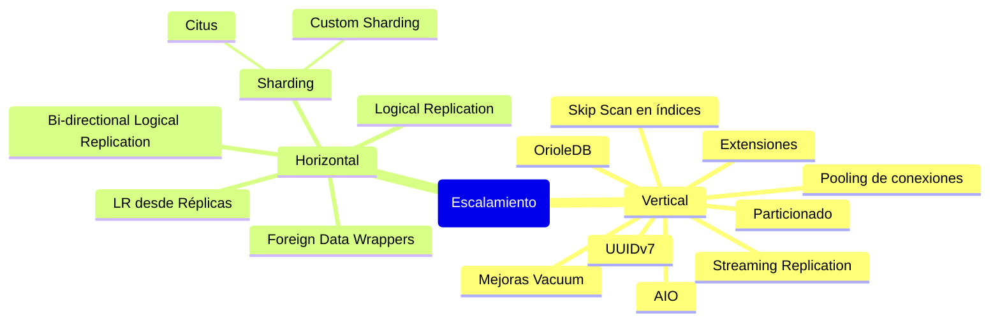

# Diagramas Generales

## Mindmap

```mermaid
mindmap
  root(Escalamiento)
    Vertical
      AIO
      Mejoras Vacuum
      Particionado
      UUIDv7 
      Streaming Replication
      Pooling de conexiones
      OrioleDB
      Extensiones
      Skip Scan en índices
    Horizontal  
      Logical Replication
      Bi-directional Logical Replication
      LR desde Réplicas
      Sharding
        Citus
        Custom Sharding
      Foreign Data Wrappers
```
