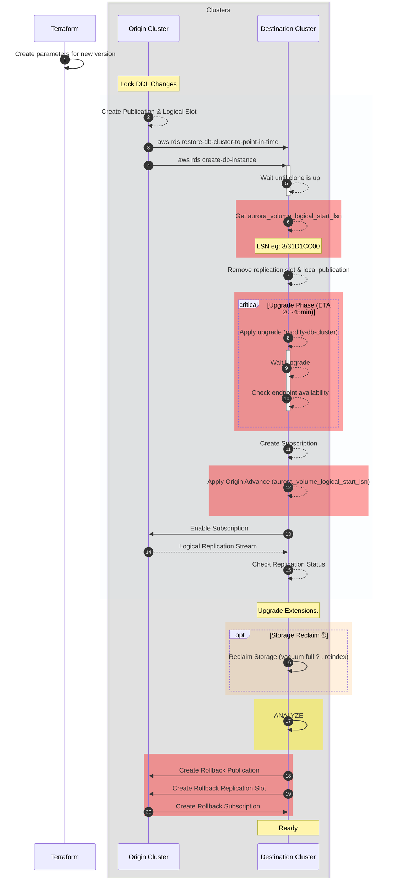
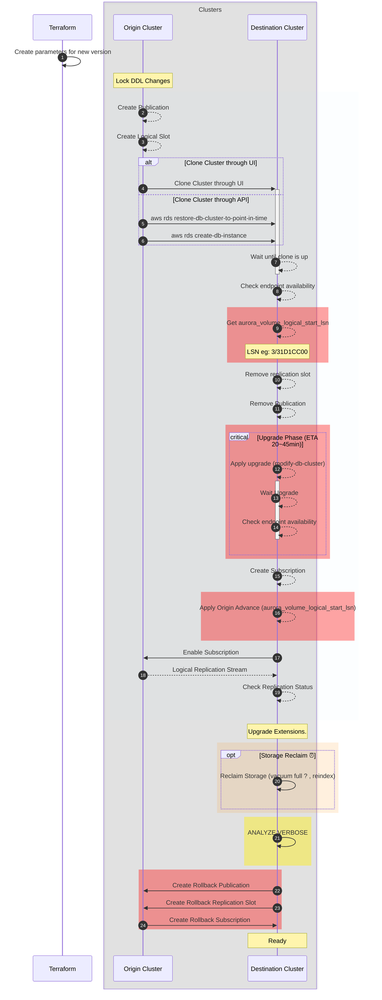
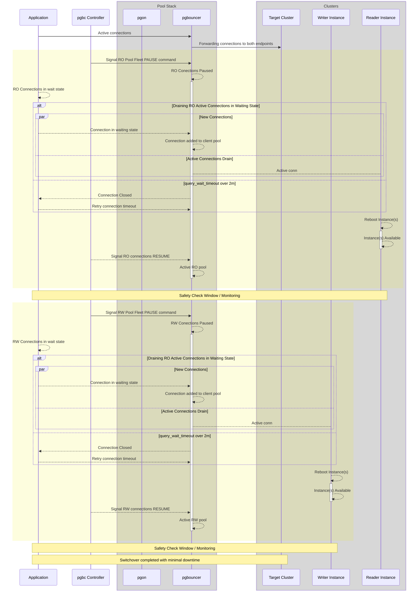

# Upgrades

## Secuencia de upgrade simplificada

```mermaid
sequenceDiagram
    autonumber
    participant Terraform as Terraform
    box rgba(100, 100, 100, 0.14) Clusters
        participant Origin as Origin Cluster
        participant Destination as Destination Cluster
    end
    Terraform->>Terraform: Create parameters for new version
    
    Note over Origin: Lock DDL Changes

    rect rgba(145, 216, 238, 0.03)
    Origin-->>Origin: Create Publication & Logical Slot


    Origin->>Destination: aws rds restore-db-cluster-to-point-in-time
    Origin->>+Destination: aws rds create-db-instance


    Destination-->>-Destination: Wait until clone is up

    rect rgba(255, 2, 2, 0.36)
        Destination-->>Destination: Get aurora_volume_logical_start_lsn
        Note over Destination: LSN eg: 3/31D1CC00
    end

    Destination-->>Destination: Remove replication slot & local publication


    rect rgba(255, 2, 2, 0.36)
    critical Upgrade Phase (ETA 20~45min)
        Destination-->>+Destination: Apply upgrade  (modify-db-cluster) 
        Destination-->>Destination: Wait Upgrade
        Destination-->>-Destination: Check endpoint availability
    end
    end

    
    Destination-->>Destination: Create Subscription

    rect rgba(255, 2, 2, 0.36)
        Destination-->>Destination: Apply Origin Advance (aurora_volume_logical_start_lsn)
    end

    Destination->>Origin: Enable Subscription
    Origin-->>Destination: Logical Replication Stream
    Destination-->>Destination: Check Replication Status

    end

    Note over Destination: Upgrade Extensions.

    rect rgba(255, 136, 0, 0.13)
        opt Storage Reclaim ⏰
           Destination->>Destination: Reclaim Storage (vacuum full ? , reindex)
        end
    end
    
    rect rgba(255, 238, 2, 0.41)
        Destination->>Destination: ANALYZE 
    end

    rect rgba(255, 2, 2, 0.36)
        Destination->>Origin: Create Rollback Publication 
        Destination->>Origin: Create Rollback Replication Slot 
        Origin->>Destination: Create Rollback Subscription
    end 

    Note over Destination: Ready
```

## Upgrades

Aurora Example with snapshot and logical replication.

```mermaid
sequenceDiagram
    autonumber
    participant Terraform as Terraform
    box rgba(100, 100, 100, 0.14) Clusters
        participant Origin as Origin Cluster
        participant Destination as Destination Cluster
    end
    Terraform->>Terraform: Create parameters for new version
    
    Note over Origin: Lock DDL Changes

    rect rgba(145, 216, 238, 0.03)
    Origin-->>Origin: Create Publication 
    Origin-->>Origin: Create Logical Slot

    alt Clone Cluster through UI
        Origin->>+Destination: Clone Cluster through UI
    else Clone Cluster through API
        Origin->>Destination: aws rds restore-db-cluster-to-point-in-time
        Origin->>Destination: aws rds create-db-instance
    end

    Destination-->>-Destination: Wait until clone is up
    Destination-->>Destination: Check endpoint availability

    rect rgba(255, 2, 2, 0.36)
        Destination-->>Destination: Get aurora_volume_logical_start_lsn
        Note over Destination: LSN eg: 3/31D1CC00
    end

    Destination-->>Destination: Remove replication slot
    Destination-->>Destination: Remove Publication

    rect rgba(255, 2, 2, 0.36)
    critical Upgrade Phase (ETA 20~45min)
        Destination-->>+Destination: Apply upgrade  (modify-db-cluster) 
        Destination-->>Destination: Wait Upgrade
        Destination-->>-Destination: Check endpoint availability
    end
    end

    
    Destination-->>Destination: Create Subscription

    rect rgba(255, 2, 2, 0.36)
        Destination-->>Destination: Apply Origin Advance (aurora_volume_logical_start_lsn)
    end

    Destination->>Origin: Enable Subscription
    Origin-->>Destination: Logical Replication Stream
    Destination-->>Destination: Check Replication Status

    end

    Note over Destination: Upgrade Extensions.

    rect rgba(255, 136, 0, 0.13)
        opt Storage Reclaim ⏰
           Destination->>Destination: Reclaim Storage (vacuum full ? , reindex)
        end
    end
    
    rect rgba(255, 238, 2, 0.41)
        Destination->>Destination: ANALYZE VERBOSE
    end

    rect rgba(255, 2, 2, 0.36)
        Destination->>Origin: Create Rollback Publication 
        Destination->>Origin: Create Rollback Replication Slot 
        Origin->>Destination: Create Rollback Subscription
    end 

    Note over Destination: Ready
```

## Switchover

```mermaid
sequenceDiagram
    
    participant App as Application
    participant pgbc as pgbc Controller

    box rgba(100, 100, 100, 0.19) Pool Stack
        participant pgon as pgon
        participant PgB as pgbouncer
    end
    
    box rgba(100, 100, 100, 0.19) Clusters
        participant Target as Target Cluster
        participant Writer as Writer Instance
        participant Reader as Reader Instance
    end

    App->>PgB: Active connections
    PgB->>Target: Forwarding connections to both endpoints


    rect rgba(238, 234, 4, 0.13)
        pgbc->>PgB: Signal RO Pool Fleet PAUSE command
        PgB-->>+PgB: RO Conections Paused
        App-->>App: RO Connections in wait state


        alt Draining RO Active Connections in Waiting State
            par New Connections
                App-->>PgB: Connection in waiting state
                PgB-->>PgB: Connection added to client pool
            and Active Connections Drain 
                PgB-->Reader: Active conn 
            end
        else query_wait_timeout over 2m
            PgB-->>App: Connection Closed
            App-->>PgB: Retry connection timeout
        end

        Reader-->>+Reader: Reboot Instance(s)
        Reader-->>-Reader: Instance(s) Available
        pgbc-->>PgB: Signal RO connections RESUME
        PgB-->>-PgB: Active RO pool

    end

    Note over App,Reader: Safety Check Window / Monitoring


    rect rgba(238, 234, 4, 0.13)
        pgbc->>PgB: Signal RW Pool Fleet PAUSE command
        PgB-->>+PgB: RW Conections Paused
        App-->>App: RW Connections in wait state


        alt Draining RO Active Connections in Waiting State
            par New Connections
                App-->>PgB: Connection in waiting state
                PgB-->>PgB: Connection added to client pool
            and Active Connections Drain 
                PgB-->Writer: Active conn 
            end
        else query_wait_timeout over 2m
            PgB-->>App: Connection Closed
            App-->>PgB: Retry connection timeout
        end

        Writer-->>+Writer: Reboot Instance(s)
        Writer-->>-Writer: Instance(s) Available
        pgbc-->>PgB: Signal RW connections RESUME
        PgB-->>-PgB: Active RW pool

    end

    Note over App,Writer: Safety Check Window / Monitoring
    Note over App,Target: Switchover completed with minimal downtime

```

