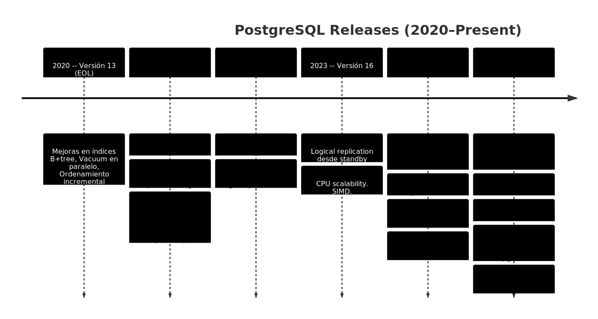
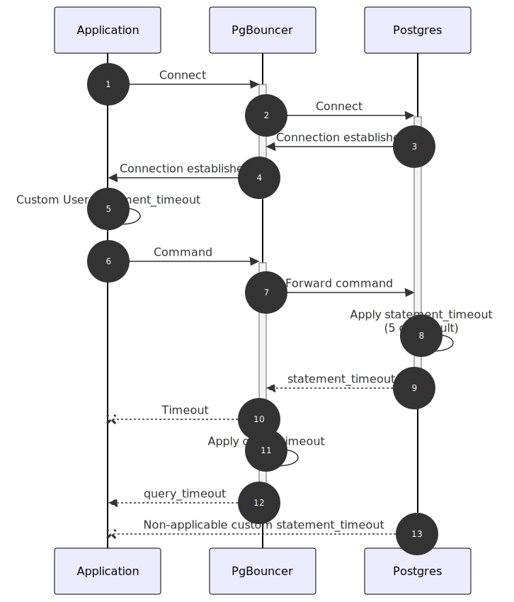

<!--
_backgroundColor: black
_color: white
_class: lead
_paginate: false
-->


# **Ecosistemas modernos sobre Postgres en Producción**

##### [Nerdearla España 2025](https://nerdearla.es)

---
<!-- backgroundColor: white 
_paginate: false
-->

### Sobre [Emanuel Calvo](https://www.linkedin.com/in/ecbcbcb/) / [tr3s.ma](https://tr3s.ma)


> _Staff Infrastructure Engineer at [Workato](https://www.workato.com/)_  
 
> **Database/Infrastructure Engineering. Consultor independiente.**
Anteriores compañías: OnGres, Percona, Pythian, 2ndQuadrant, entre otras.


 

---

# Agenda

<br/>

<div class="container">
<div class="col">
ℹ️ Postgres Hoy <br/>
⏳ Alta Disponibilidad y Escalado Vertical<br/>
💾 Respaldos <br/>
🔄 Poolers y balanceadores <br/>

</div>
<div class="col">
ℹ️ Extensiones <br/>
ℹ️ Monitoreo <br/>
↔️ Escalamiento Horizontal <br/>
⬆️ Upgrades (Blue/Green, Seamless) <br/>

</div>

---
<!-- _backgroundColor: rgb(241, 184, 76) -->

# [Laboratorios](https://github.com/3manuek/labs)


---
<!-- _backgroundColor: rgb(241, 184, 76) -->

# [Presentación](https://github.com/3manuek/slides/tree/master/2025/Nerdearla.es)


---

# Sobre PostgreSQL 

| Característica    | Descripción |
|-------------------|-------------|
| Open Source       | _El GNU/Linux de las bases de datos_. Releases anuales estables. |
| Versatilidad      | Desde contenedores hasta bare metal. Presente en la mayor cantidad de proveedores en la nube, kubernetes e incluso desde el [browser](http://pglite.dev). Sandbox de [psql](https://psql.sh/). |
| Funcionalidades   | ACID, Framework de extensiones, Integrabilidad (CDC, FDWs). |


---

# ¿Postgres para todo?

- Existen dos trends que se dieron estos últimos años:
  - [Use Postgres for everything](https://github.com/Olshansk/postgres_for_everything)
  - [Does **not** fit for all](https://cs.brown.edu/~ugur/fits_all.pdf)
- Es muy posible que para el 90% de los casos, Postgres cubra las necesidades.
- Las limitaciones pueden darse tanto a nivel de escalamiento vertical como horizontal.

---

# Alternativas (I)

| Tecnología | Alternativa |
|---|---|
| Elasticsearch | tsquery/tsvector, pgvector, [ParadeDB](https://www.paradedb.com/) |
| MongoDB | jsonb, pgvector, [FerretDB](https://www.ferretdb.com/) |
| Redis | Unlogged tables, hstore |
| OLAP/Snowflake | [pg_lake](https://github.com/snowflake-labs/pg_lake), [pg_mooncake](https://github.com/Mooncake-Labs/pg_mooncake), [pg_duckdb](https://github.com/duckdb/pg_duckdb) | 
| Queue | [pgmq](https://github.com/pgmq/pgmq), Listen/Notify |

---

# Alternativas (II)

| Tecnología | Alternativa |
|---|---|
| Pub/Sub | Particionado, Logical Decoding. [Topic Partitions](https://topicpartition.io/blog/postgres-pubsub-queue-benchmarks)| 
| Desarrollo de APIs | [PostgREST](https://github.com/PostgREST/postgrest), [Prest](https://github.com/prest/prest) |
| Time Series | [TigerData (TimescaleDB)](https://tigerdata.com) |
| Spatial | [PostGIS](https://postgis.net/) |
| _Live_ Materialized Views | [Epsio](https://docs.epsio.io)| 

---

# Escalamiento
<br />


---

# Feature Timeline




---

# Sumario: PostgreSQL 14–17

- **v14**: Modo Pipeline en libpq, tipos multirango, particionado online.
- **v15**: Replicación lógica por columna, security by default.
- **v16**: [SIMD](https://en.wikipedia.org/wiki/Single_instruction,_multiple_data) (Single Instruction, Multiple data) , parallelism, SQL/JSON constructors, replicación lógica en standbys.
- **v17**: Vacuum memory revolution (Radix Algorithm), complete SQL/JSON, respaldos incrementales, slots de replicación lógica síncronos (failover estables).

> [PGFeatureDiff](https://pgfeaturediff.com/)

---

# Postgresql v18 (1)

- **⚠️** | **Asynchronous I/O (AIO)** provee un estimado de 2/3x en mejora de rendimiento. [io_uring/liburing support commit](https://github.com/postgres/postgres/commit/c325a7633fcb33dbd73f46ddbbe91e95ddf3b227)
  - Impacta en lecturas secuenciales y bitmap scans, además de una significativa mejora en el rendimiento de VACUUM. [No siempre es mejor tenerlo activado](https://vondra.me/posts/tuning-aio-in-postgresql-18/).
  - Valores de `io_method ` pueden ser: `worker`, `sync`, `io_uring`. Número de _workers_ controlado en `io_workers`.
  - Monitoreo de Operaciones de IO: `pg_aios`.  
  - Cálculos CRC32 con una mejora de rendimiento de **0.5x** a **3x** en instrucciones AVX-512 (AMD e Intel) para cálculo de rutas. [Article](https://www.phoronix.com/news/PostgreSQL-CRC32C-AVX512)

---

## (2) UUID v4 vs v7

- **🚨** | **UUID v7**. Importante para: escalamiento horizontal y distribución de datos.
  - UUID v4: Todos bits aleatorios excepto por la versión (4 bits) y _variant_ (2 bits).
  - Mejor distribución, ordenamiento por _timestamp_, mejores tiempos de inserción, menor cantidad de _splits_ de páginas de índices.
  - Funciones "helper" como ej. `uuid_extract_timestamp(uuidv7())`
  - Ya existía una extensión para utilizar la versión, pero ahora es parte del core.

```bash
0199198f-e9d0-749d-9336-816392664f87
------------- Timestamp 48 bits millisecond since epoch
              - Version 4 bits
               --- Random
                   - Variant 2 bits
                    ---------------- Random
```

---

## (3) NUMA (Non-Uniform Memory Access)

- **NUMA awareness**: 
  - Presentaciones y artículos: [PGConf.EU](https://anarazel.de/talks/2024-10-23-pgconf-eu-numa-vs-postgresql/numa-vs-postgresql.pdf), [Thread on NUMA observability](https://www.postgresql.org/message-id/CAKZiRmxh6KWo0aqRqvmcoaX2jUxZYb4kGp3N%3Dq1w%2BDiH-696Xw%40mail.gmail.com), y [este artículo](https://www.phoronix.com/news/PostgreSQL-Lands-NUMA-Awareness).
- Requiere opción de compilación `--with-libnuma`.

```sql
postgres=# select numa_zone_id, count(*) from pg_buffercache group by numa_zone_id;
NOTICE:  os_page_count=32768 os_page_size=4096 pages_per_blk=2.000000
 numa_zone_id | count
--------------+-------
              | 16127
            6 |   256
            1 |     1
```

---

## (4) Otras características relevantes

- **⚠️** |  Soporte _B-tree Skip Scan_ (no es necesario especificar las primeras columnas del índice en filtros). `OR/IN` se convierten en `ANY(array)`
- Soporte OAuth 2.0. `oauth_validator_libraries` setting en `pg_hba.conf`. `ssl_tls13_ciphers` para soporte de TLS 1.3. Negociación de TLS directa.
- **⚠️** |  **Preservación de estadísticas en upgrade**, migración paralela y swapping de directorios. 
- **⚠️** | **MD5 depreation warning**
- **⚠️** | **Data Checksums** por defecto.
- **⚠️** | Versión de Protocol `3.2` (última actualización en 2003, 7.4).


---

<!-- _backgroundColor: black -->


# Alta Disponibilidad y Escalamiento Vertical

---

# Configuración 

- [PGTune](https://pgtune.leopard.in.ua/): Configuración de Postgres para diferentes hardware.
- [postgresqlco.nf](https://postgresqlco.nf/): Toda la información de la configuración de Postgres.

---

# Replicación

- Streaming Replication
  - Utilizada para PITR, DR y escalamiento _vertical_ (creación de réplicas).
  - Permite replicación síncrona. 🚨
  - Es a nivel de _cluster de datos_.
- Logical Replication (escalamiento vertical u horizontal).
  - Modelo pub/sub.
  - Logical Decoding + `pgoutput` plugin.
  - Synchronous Slots (+17). (`CREATE SUBSCRIPTION... failover=true`).
  - Permite publicar desde una réplica. (+16).
- Logical Decoding
  - Permite utilizar un plugin distinto (`test_decoding`, `wal2json`, ...).

---

# Soluciones de (o con) Alta Disponibilidad

- Utilizan DCS (Distributed Consensus Service) para la elección de líder.
  - [Patroni](https://github.com/patroni/patroni). 
  - [Stolon](https://github.com/sorintlab/stolon). Incluye proxies.
  - [pg_auto_failover](https://github.com/hapostgres/pg_auto_failover). Provee consenso propio.

- [Yugabyte](https://docs.yugabyte.com/preview/yugabyte-platform/administer-yugabyte-platform/high-availability/). Replicación basada en protocolo RAFT.
- Citus provee su mecanismo de HA a través de _working groups_.
- [EDB Distributed](https://www.enterprisedb.com/docs/edb-postgres-ai/cloud-service/references/supported_cluster_types/distributed_highavailability/).
  - Multi-master con Replicación Lógica. 

---

## Lab:[Patroni 101](https://github.com/3manuek/labs/tree/main/patroni)

- HAproxy Entrypoint + checks
- PgBouncer Pools
- Patroni callbacks



---

## Dentro de un nodo de Patroni



---

## Patroni Básico



---

# [Multi region Patroni and Consul](https://ongres.com/blog/improving-your-postgres-high-availability/)

---



---

# Columnar Storage

- [TigerData Columnar Compression](https://www.tigerdata.com/blog/building-columnar-compression-in-a-row-oriented-database)
- [Citus Columnar Storage](https://github.com/citusdata/citus/tree/main/src/backend/columnar)
  - [cstore_fdw](https://github.com/citusdata/cstore_fdw)
- [Hydra](https://github.com/hydradatabase/columnar)
- [pg_mooncake](https://github.com/Mooncake-Labs/pg_mooncake). Mirror a Apache Iceberg.

---

# Respaldos (Físicos)

- [pgBackRest](https://pgbackrest.org/)
  - Soporta paralelismo, incrementales, almacenamiento en Block Storage y reposiorios on-premise.
- [Barman](https://www.pgbarman.org/)
- [WAL-G](https://github.com/wal-g/wal-g)
- [Backup & Recovery](https://www.postgresql.org/docs/18/backup-recovery.html)
  - Respaldos _full_ or incrementales desde la versión 17.

> Los respaldos físicos permiten recuperación en caso de desastre y levantar réplicas sin impactar otros nodos.

--- 

# Respaldos (Lógicos)

- Buena práctica: Siempre tener respaldos lógicos con `pg_dump`.

> Los respaldos lógicos son útiles para manipulación de datos, restauración en otros ambientes o para mover bases pequeñas.

---

## Balanceo o entrypoint

- [pgpool-II](https://www.pgpool.net/): Pool, balanceo y clustering.
- [HAProxy](https://www.haproxy.org/)
- [Envoy](https://www.envoyproxy.io/): Soporta reporte de métricas de cada consulta. Open Telemetry.

---

## Poolers (Control de conexiones)

- [PgBouncer](https://www.pgbouncer.org/): Single Thread, opción por defecto.
- [pgcat](https://github.com/postgresml/pgcat): Soporta Sharding por Hash. 
- [pgdog](https://pgdog.dev): Soporte de sharding por hash.
- [Odyssey](https://github.com/yandex/odyssey)
- [ProxySQL](https://proxysql.com/): Soporta _query rewrite_.
- AWS RDS Proxy. 


---

# Ejemplo de Pooling Fleet




---

# [Timeouts de conexiones en cascada](https://tr3s.ma/posts/2024-10/pgbouncer/)

<div class="container">
  <div class="col">
    
  </div>
  <div class="col">
    
  </div>
</div>

---

# Monitoreo (1)

- [Prometheus](https://prometheus.io/) + [Grafana](https://grafana.com/) + [postgres_exporter](https://github.com/prometheus-community/postgres_exporter).
- [Open Telemetry](https://opentelemetry.io/)
- [pgAnalyze](https://pganalyze.com/). Recomendación de índices 👌🏻.
- [Percona Monitoring and Management](https://www.percona.com/software/database-tools/percona-monitoring-and-management)
- Ejemplo de [Logs Distribuidos en StackGres](https://stackgres.io/doc/1.5/administration/distributed-logs/).

---

# Monitoreo (2)

## eBPF

- [Cilium / Cloud Native Operator](https://cloudnative-pg.io/documentation/1.27/cncf-projects/cilium/)
- [eBPF pgtracer](https://github.com/Aiven-Open/pgtracer)

---
<!-- _backgroundColor: black -->

# ↔️ Escalamiento Horizontal


---

## Soluciones de Escalamiento Horizontal

- [Citus](https://www.citusdata.com/). 
  - **Columnar Storage**, Sharding y Replicación. Uso de _coordinators_ y _workers_.
- [Yugabyte](https://www.yugabyte.com/)
- [Multigres](https://github.com/multigres/multigres) / Vitess-like
- Bi-directional Logical Replication
- Foreign Data Wrappers (FDW)
  - [postgres_fdw](https://www.postgresql.org/docs/current/postgres-fdw.html)
  - [FDWs](https://wiki.postgresql.org/wiki/Foreign_data_wrappers)

---

# [Bidirectional Logical Replication](https://aws.amazon.com/blogs/database/postgresql-bi-directional-replication-using-pglogical/)

- `pglogical` permite configurar el comportamiento de la replicación lógica.
  - `pglogical.conflict_resolution` (`error`, `apply_remote`, `keep_local`, `last_update_wins`, `first_update_wins`)
  - `shared_preload_libraries = 'pglogical'` + `wal_level = 'logical'`
  - `pglogical.replicate_ddl_command`
- [Desde versión 16](https://www.highgo.ca/2023/12/18/new-in-postgresql-16-bi-directional-logical-replication/)
- [BDR](https://www.enterprisedb.com/docs/pgd/4/bdr/)


---

# ETL, extracción

- [etl by Supabase](https://github.com/supabase/etl)
- [dbt](https://www.dbt.com/)

---

## ↔️ [Sharding por Hash con pgcat](https://tr3s.ma/posts/2025-01/pgcat/)



---

# [Citus (1)](https://github.com/3manuek/labs/blob/main/swarm/compose/citus/docker-compose-citus.yaml)




---
# Citus (2)

```sql
CREATE EXTENSION IF NOT EXISTS citus;

-- Registro de workers
SELECT master_add_node('worker1', 5432);
SELECT master_add_node('worker2', 5432);

-- Creación de tablas distribuidas
SELECT create_distributed_table('companies',   'id');
SELECT create_distributed_table('campaigns',   'company_id');

-- Creación de índices distribuidos por PK
SELECT create_distributed_index('companies', 'id');
SELECT create_distributed_index('campaigns', 'id');
```

---
<!-- _backgroundColor: black -->

# 🚧 Upgrades

---

## _Seamless_ Upgrades (Fase de Upgrade)

* Con snapshot+LR (ideal para clústeres "grandes"):
    * Crear (cluster) snapshot, tomar el LSN (Logical Sequence Number) del cluster restaurado y aplicar `pg_upgrade` (o `modify-db-cluster` en RDS/Aurora).
    * Configurar LR con el LSN desde Origin -> Destination cluster.
      * ```
        roname=$(psql_destination "
        SELECT 'pg_'||oid::text
        FROM pg_subscription 
        WHERE subname = '${SUBSCRIPTION_NAME}';")
        ```
      * En PG vanilla: `LSN=$(psql -c "SELECT pg_current_wal_lsn();")`
      * En Aurora: `LSN=$(psql -c "SELECT aurora_volume_logical_start_lsn();")`
      * `SELECT pg_replication_origin_advance('${roname}', '<LSN>');`

---

## Lab:[Upgrade con LR "plano"](https://github.com/3manuek/labs/tree/main/logical_replication)

* Con Logical Replication:
  * Crear LR con `copy_data = true`.
  * Recomendado `disable_on_error` y `streaming=on`.
  * ⚠️ WARNING: Cuidado con extensiones que actualizan metadatos, como Postgis. Usar publicaciones con definición expandida. 

---

## Fase de Switchover

* Requiere una capa de pooling que permita controlar las conexiones.
* Flow:
  * `PAUSE`
  * Configuración Pool (ej. sección de `databases` en pgbouncer).
  * Drain active connections y **lag=0**.
  * `RESUME` en PgBouncer.
* [Upgrades con LR](https://www.postgresql.org/docs/current/logical-replication-upgrade.html)

---

# Limitaciones y consideraciones en Upgrades

- <v17: `ANALYZE` antes del switchover.
- Conexiones directas al cluster de origen tienen que ser paradas y redirigidas.
- Ciertas extensiones, como Postgis, tienen tablas de metadatos que tienen que ser excluídas.
- Las versiones de las extensiones en destino tienen que ser actualizadas si se utiliza un snapshot+LR.
- `track_commit_timestamp` habilitado es muy útil para debuguear, pero 1) agrega cierto overhead y 2) pierde su utilidad cuando se usa `streaming=parallel`. 

---

# Operadores k8s / Soluciones integradas

* [Cloud Native PostgreSQL](https://cloudnative-pg.io/)
* [Crunchy Data](https://www.crunchydata.com/)
* [Zalando](https://github.com/zalando/postgres-operator)
* [StackGres](https://www.stackgres.io/)
* [Neon](https://neon.tech/)
* [Pigsty](https://pigsty.io)
* [Omnigres](https://omnigres.com/)

---

# Extensiones

Links y extensiones relevantes:
- [TDE](https://github.com/percona/pg_tde)
- [pg_oidc_validator](https://github.com/Percona-Lab/pg_oidc_validator)
- [+1000 extensiones](https://gist.github.com/joelonsql/e5aa27f8cc9bd22b8999b7de8aee9d47)
- [PGXN](https://pgxn.org)
- [pglogical](https://github.com/2ndQuadrant/pglogical)
- [openai extension](https://github.com/pramsey/pgsql-openai) / [read](https://www.crunchydata.com/blog/accessing-large-language-models-from-postgresql)

---

# Menciones Especiales

- [OrioleDB](https://www.orioledb.com/docs/usage/decoupled-storage) 
    - Almacenamiento y Cómputo desacoplado.
- [OCI Images](https://ongres.com/blog/why-postgres-extensions-should-be-distributed-and-packaged-as-oci-images/) / [PGA](https://speakerdeck.com/ongres/postgres-a-la-carte-dynamic-container-images-with-your-choice-of-extensions)
    - Imágenes de contenedores dinámicas (docir). PGA (Postgres Anywhere)

--- 
 
## Referencias/Links (1)

- [PostgreSQL 18: 10 Powerful New Features Devs Need to Know](https://dev.to/dev_tips/postgresql-18-just-dropped-10-powerful-new-features-devs-need-to-know-3jf)
- [PostgreSQL 18 Release Notes](https://www.postgresql.org/docs/18/release-18.html)
- [Why upgrade? (depesz.com)](https://why-upgrade.depesz.com/show?from=15.14&to=17.6)
- [Neon article about features](https://neon.com/postgresql/postgresql-18-new-features)

---

## Referencias/Links (2)

- [More DBA perspective features in v18](https://www.bytebase.com/blog/what-is-new-in-postgres-18/)
- [Postgres with dynamic containers](https://speakerdeck.com/ongres/postgres-a-la-carte-dynamic-container-images-with-your-choice-of-extensions)
- [Postgres as OCI images](https://ongres.com/blog/why-postgres-extensions-should-be-distributed-and-packaged-as-oci-images/)
- [PGTune](https://pgtune.leopard.in.ua/)
- [Multiregion with Patched Patroni and Consul](https://ongres.com/blog/improving-your-postgres-high-availability/)
- [Howtos](https://github.com/postgres-ai/postgres-howtos)

---

<!-- backgroundColor: lightgrey -->

# ¡Gracias!

<div class="container">
  <div class="col">
    
  </div>
  <div class="col">
    <ul>
      <li><a href="https://www.workato.com/careers">Workato careers</a></li>
      <li><a href="https://grnh.se/4phjde292us">Senior Infrastructure Engineer (ML/AI)</a></li>
      <li><a href="https://grnh.se/n0cahuda2us">Senior Infrastructure Engineer (Core Infra - Sec/Net)</a></li>
      <li><a href="https://grnh.se/ngt9btq22us">Senior Infrastructure Engineer (Core Infra)</a></li>
    </ul>
  </div>
</div>

